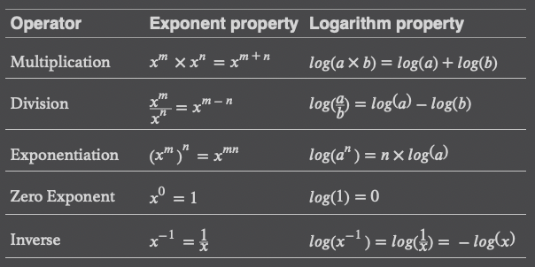

# Basic Math and Calculus Review

## Number Theory

1. **Natural number:** These are the numbers _1, 2, 3,.._ and so on. Only positive numbers are included here.
2. **Whole number:** Adding to natural numbers, the concept of _"0"_ was later accepted, we call these "whole numbers".
3. **Integers:** Integer include positive and negative natural numbers as well as _0_.
4. **Rational numbers:** Any number that you can express as a fraction, such as _2/3_ is a rational number..
5. **Irrational numbers:** Irrational numbers cannot be expressed as a fraction.
6. **Real numbers:** Real numbers include rational as well as irrational numbers.
7. **Complex and imaginary numbers:** You encounter this number type when you take the square root of a negative number.

In data science, you will find most (if not all) of your work will be using **whole numbers**, **natural numbers**, *
*integers**,
and **real numbers**.

## Order of Operations

> Exponents → Multiplication → Division → Addition → Subtraction

## Variables

In mathematics, a _variable_ is a named placeholder for an unspecified or unknown number

## Function

- _Functions_ are expressions the define relationships between two or more variables. More specifically, a function
  takes
  _input variables_, plugs them into an expression, and then results in an _output variable_.

- Functions are useful because they model a predictable relationship between variables.

## Summations

A _summation_ is expressed as a sigma `∑` and adds elements together.

## Exponents

_Exponents_ multiply a number by itself a specified number of times.

## Logarithms

- A _logarithm_ is a math function that finds a power for a specific number and base.
- It may not sound interesting at first, but it actually has many applications.
    - From measuring earthquakes to managing volume on your stereo.
    - Key part of logistic regression.

## Euler's Number and Natural Logarithms

### Euler's Number

- There is a special number that shows up quite a bit in math called Euler's number `e`.
- It ia a special number much like `Pi π` and is approximately `2.71828`.
- `e` is used a lot because it mathematically simplifies a lot of problems.

### Natural Logarithms

When we use `e` as our base for a logarithm, we call it a _natural logarithm_.

### Limits

When we forever increase or decrease an input variable and the output variable keeps approaching a value but never
reaching it.

## Derivatives

A _derivative_ tells the _slope_ of a function, and it is useful to measure the _rate of change_ at any point in a
function.

### Partial Derivatives

They are derivatives of functions that have multiple input variables.

### The chain rule

- The chain rule says that for a given function `y` (with input variables `x`) composed into another function `z` (with
  input variables `y`), we can find the derivative of `z` with respect to `x` by multiplying the two respective
  derivatives together.
- The chain rule is a key part of training a neural network with the proper weights and biases. Rather than untangle the
  derivative of each node in a nested onion fashion, we can multiply the derivatives across each node instead, which is
  mathematically a lot easier.

## Integrals

- The opposite of a derivative is an _integral_, which finds the area under the curve for a given range.

=====================================  
**_Ref: [Code Demo](chapter1.py)_**