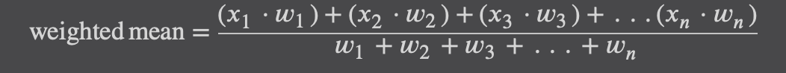

# Descriptive and Inferential Statistics

## Overview

- Statistics is the practice of collecting and analyzing data to discover findings that are useful or predict what
  causes those findings to happen.
- Probability often plays a large role in statistics, as we use data to estimate how likely an event is to happen.

### What is Data?

Data is just like photographs; it provides snapshots of a story.

### Descriptive versus Inferential Statistics

- What comes to mind when you hear the word "statistics"? It is calculating mean, median, mode, charts, bell, curves,
  and other tools to describe data? This is the most commonly understood part of statistics called _descriptive
  statistics_, and we use it to summarize data. After all, is it more meaningful to scroll through a million records of
  data or have it summarized?
- _Inferential statistics_ tries to uncover attributes about a larger population, often based on a sample. It is often
  misunderstood and less intuitive than descriptive statistics. Often we are interested in studying a group that is too
  large to observe and we have to resort to using only a few members of that group to infer conclusions about them.

### Populations, Samples, and Bias

- A population is a particular group of interest we want to study.
- A sample is a subset of the population that is ideally random and unbiased, which we use to infer attributes about the
  population. We often have to study samples because polling the entire population is not always possible.

### Descriptive Statistics

Descriptive statistics is the area most people are familiar with. We will touch on the basics like mean, median, and
mode followed by variance, standard deviation, and the normal distribution.

#### Mean and Weighted Mean

- The _mean_ is the average of a set of values. The operation is simple to do: sum the values and divide by the number
  of
  values. The mean is useful because it shows where the "center of gravity" exists for an observed set of values.
  
- The _mean_ is actually a weighted average called the _weighted mean_. The mean we commonly use gives equal importance
  to each value. But we can manipulate the mean and give each item a different weight.
  

#### Median

- The _median_ is the middlemost value in a set of values.
- The _median_ can be helpful alternative to the _mean_ when data is skewed by outliers, or values that are extremely
  large and small compared to the rest of the values.

#### Mode

- The _mode_ is the most frequently occurring set of values. It primarily becomes useful when your data is repetitive,
  and you want to find which values occur the most frequently.

#### Variance and Standard Deviation

When we start talking about variance and standard deviation, this is where it gets interesting. One thing that
confuses people with variance and standard deviation is there are some calculations differences for the sample versus
the population.

- Population Variance and Standard Deviation

    - Variance
      
    - Standard Deviation
      

- Sample Variance and Standard Deviation

    - Variance
      
    - Standard Deviation
      

#### The Normal Distribution

- The _normal distribution_ also known as the _Gaussian distribution_, is a symmetrical bell-shaped distribution that
  has most mass around the mean, and its spread is defined as a standard deviation. The "tails" on either side become
  thinner as you move away from the mean.
- Properties of a normal distribution
    - It's symmetrical; both sides are identically mirrored at the mean, which is the center.
    - Most mass is at the center around the mean.
    - It has a spread (being narrow or wide) that is specified by standard deviation.
    - The "tails" are the least likely outcomes and approach zero infinitely but never touch zero.
    - It resembles a lot of phenomena in nature and daily life, and even generalizes non-normal problems because of the
      central limit theorem.

#### The Inverse CDF

#### Z-scores

## Inferential Statistics

### The Central Limit Theorem

### Confidence Intervals

### Understanding P-values

### Hypothesis Testing

## The T-Distribution: Dealing with Small Samples

## Big Data Considerations and the Texas Sharpshooter Fallacy

=====================================  
**_Ref: [Code Demo](chapter3.py)_**