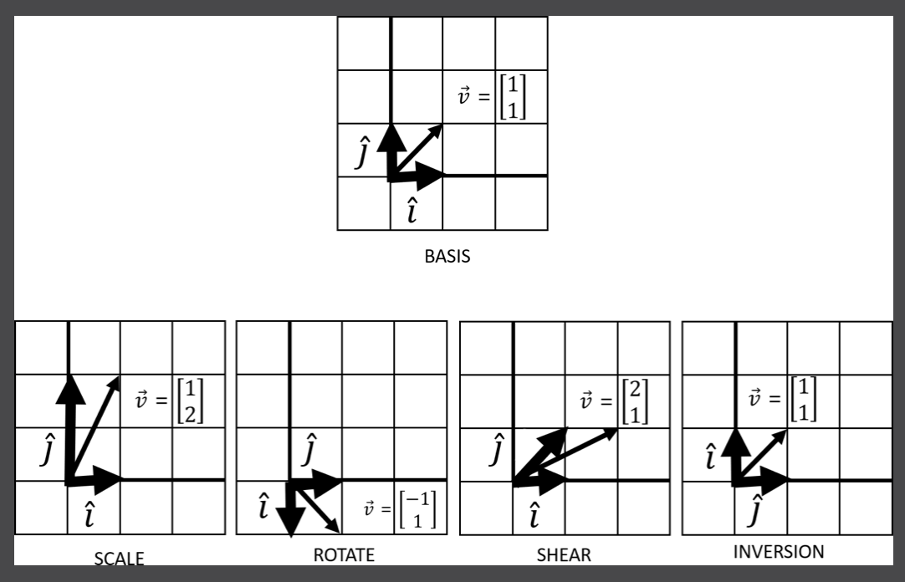
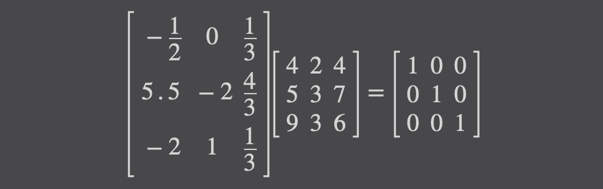
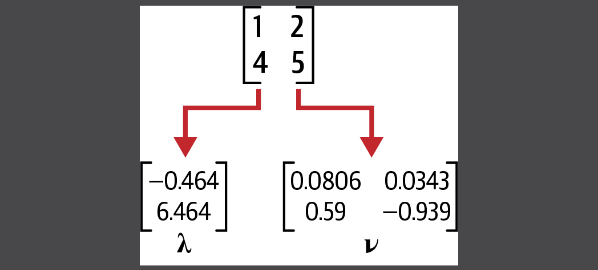

# Linear Algebra

_Linear algebra_ is hugely fundamental to many applied areas of math, statistics, operations research, data science, and
machine learning.

## What is Vector?

- A _vector_ is an arrow in space with a specific direction and length, often representing a piece of data.
- It is the central building block of linear algebra, including matrices and linear transformations.

### Adding and Combining Vectors

Simply add the respective x-values and then the y-values into a new vector

### Scaling Vectors

Scaling is growing or shrinking a vector's length. You can grow/shrink a vector by multiplying or scaling it with a
single value, known as a scalar.

### Span and Linear Dependence

- This whole space of possible vectors is called `span`, and in most cases our span can create unlimited vectors off
  those
  two vectors, simply by scaling and summing them. When we have two vectors in two different directions, they are
  `linearly independent` and have this unlimited span.
- What happens when two vectors exist in the same direction, or exist on the same line? The combination of those vectors
  is also stuck on the same line, limiting our span to just that line. No matter how you scale it, the resulting sum
  vector is also stuck on that same line. This makes them `linearly dependent`.
- A simple tool called the `determinant` to check for linear dependence, but why do we care whether two vectors are
  linearly dependent or independent? A lot of problems become difficult or unsolvable when they are linearly dependent.
  For example, when we learn about systems of equations later in this chapter, a linearly dependent set of equations can
  cause variables to disappear and make the problem unsolvable. But if you have linear independence, that flexibility to
  create any vector you need from two or more vectors becomes invaluable to solve for a solution!

## Linear Transformations

This concept of adding two vectors with fixed direction, but scaling them to get different combined vectors, is hugely
important. This combined vector, except in cases of linear dependence, can point in any direction and have any length we
choose.

### Basis Vectors

- Imagine we have two simple vectors i and j (“i-hat” and “j-hat”). These are known as basis vectors, which are used to
  describe transformations on other vectors. They typically have a length of 1 and point in perpendicular positive
  directions.
- A linear transformation, which we transform a vector with stretching, squishing, sheering, or rotating by tracking
  basis vector movements.
- These four linear transformations are a central part of linear algebra. Scaling a vector will stretch or squeeze it.
  Rotations will turn the vector space, and inversions will flip the vector space so that i and j swap respective
  places.
  

### Matrix Vector Multiplication

- The formula to transform a vector `v` given basis vectors `i` and `j` packaged as a matrix is:
  

  where `i` is the first column `[a, c]` and `j` is the column `[b, d]`

- This transformation of a vector by applying basis vectors is known as _matrix vector multiplication_.

## Matrix Multiplication

- Think of matrix multiplication as applying multiple transformations to a vector space. Each transformation is like a
  function, where we apply the innermost first and then apply each subsequent transformation outward.
- Note that the order you apply each transformation matters.

## Determinants

- When we perform linear transformations, we sometimes “expand” or “squish” space and the degree this happens can be
  helpful.
- Determinants describe how much a sampled area in a vector space changes in scale with linear transformations, and this
  can provide helpful information about the transformation.
- So testing for a 0 determinant is highly helpful to determine if a transformation has linear dependence. When you
  encounter this you will likely find a difficult or unsolvable problem on your hands.

## Special Types of Matrices

### Square Matrix

- The square matrix is a matrix that has an equal number of rows and columns:
- They are primarily used to represent linear transformations and are a requirement for many operations like
  eigen-decomposition.
  

### Identity Matrix

The identity matrix is a square matrix that has a diagonal if `1` while the other values are `0`.

### Inverse Matrix

- An inverse matrix is a matrix that undoes the transformation for another matrix.
- When we perform matrix multiplication between `A^(-1)` and `A`, we will end up with an `identity matrix`.
  
  
  

### Diagonal Matrix

Similar to the identity matrix is the diagonal matrix, which has a diagonal of nonzero values while the rest of the
values are 0. Diagonal matrices are desirable in certain computations because they represent simple scalars being
applied to a vector space. It shows up in some linear algebra operations.

### Triangular Matrix

- Similar to the diagonal matrix is the triangular matrix, which has a diagonal of nonzero values in front of a triangle
  of values, while the rest of the values are 0.
- Triangular matrices are desirable in many numerical analysis tasks, because they typically are easier to solve in
  systems of equations.
  

### Sparse Matrix

Occasionally, you will run into matrices that are mostly zeroes and have very few nonzero elements. These are called
sparse matrices. From a pure mathematical standpoint, they are not terribly interesting. But from a computing
standpoint, they provide opportunities to create efficiency. If a matrix has mostly 0s, a sparse matrix implementation
will not waste space storing a bunch of 0s, and instead only keep track of the cells that are nonzero.

## Systems of Equations and Inverse Matrices

One of the basic use cases for linear algebra is solving systems of equations. It is also a good application to learn
about inverse matrices.

## Eigenvectors and Eigenvalues

- Matrix decomposition is breaking up a matrix into its basic components, much like factoring numbers (e.g., 10 can be
  factored to 2 × 5).

- Matrix decomposition is helpful for tasks like finding inverse matrices and calculating determinants, as well as
  linear regression.
  There are many ways to decompose a matrix depending on your task.

- Eigen-decomposition is helpful for breaking up a matrix into components that are easier to work with in different
  machine learning tasks. Note also it only works on square matrices.

- In eigen-decomposition, there are two components: the eigenvalues denoted by lambda `λ` and eigenvector by `v` shown
  in this:
  

  =====================================  
  **_Ref: [Code Demo](chapter4.py)_**