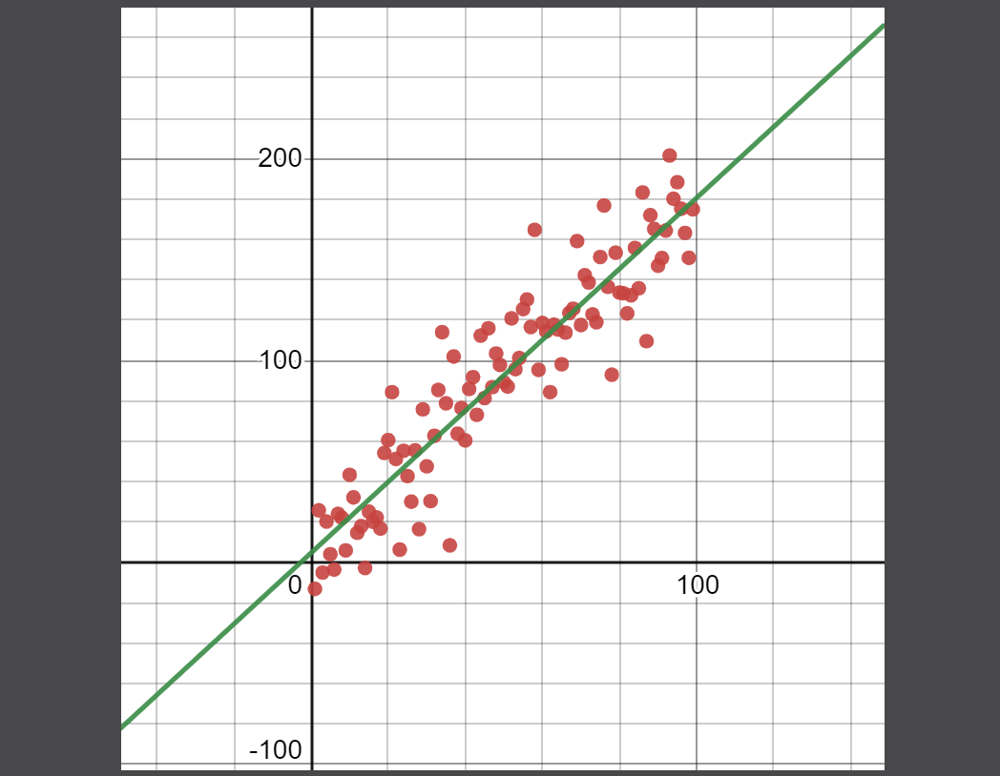
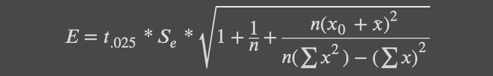
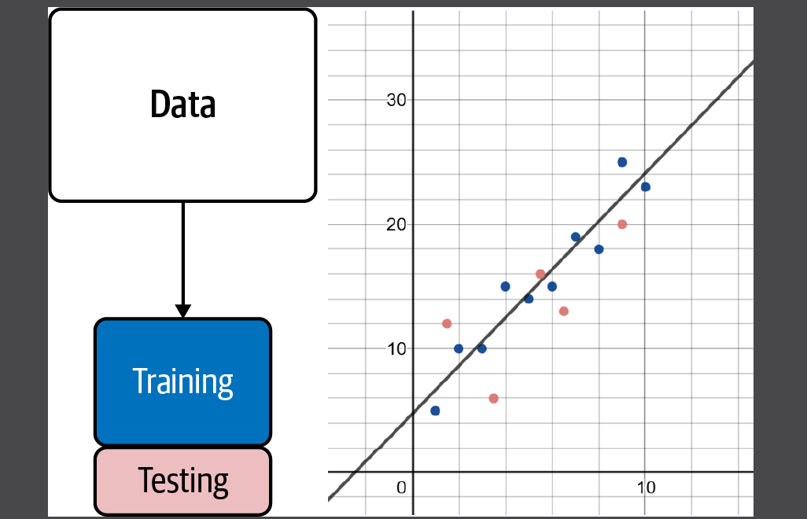
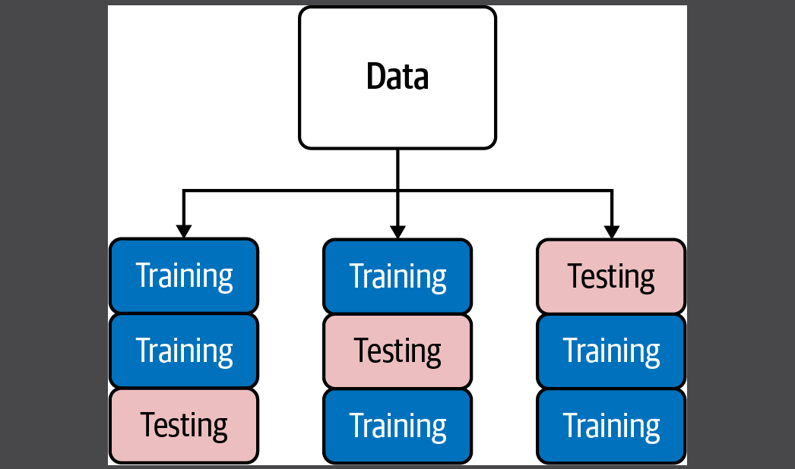

# Linear Regression

- One of the most practical techniques in data analysis is fitting a line through observed data points to show a
  relationship between two or more variables.
- A _regression_ attempts to fit a function to observed data to make predictions on new data.
- A _linear regression_ fits a straight line to observed data, attempting to demonstrate a linear relationship between
  variables and make predictions on new data yet to be observed.

## A Basic Linear Regression

### Residuals and Squared Errors

- How do statistics tools like `scikit-learn` come up with a line that fits to these points? It comes down to two
  questions that are fundamental to machine learning training:
    - _What defines a "best fit"?_
    - _How do we get to that "best fit"?_
- The first question has a pretty established answer: we minimize the squares, or more specifically the sum of the
  squared residuals.
- We want to minimize these residuals in total so there is the least gap possible between the line and points. But how
  do we measure the "total"? The best approach is to take the sum of squares, which simply squares each residual, or
  multiplies each residual by itself, and sums them. We take each actual y-value and subtract from it the predicted
  y-value taken from the line, then square and sum all those differences.

### Finding the Best Fit Line

- We now have a way to measure the quality of a given line against the data points: the sum of squares. The lower we can
  make that number the better the fit. Now how do we find the right `m` and `b` values that create the _least_ sum of
  squares?
- Five techniques you can use:
    - Closed form
    - Matrix inversion
    - Matrix decomposition
    - Gradient descent
    - Stochastic Gradient Descent

#### Closed Form Equation

#### Inverse Matrix Techniques

We can use transposed and inverse matrices to fit a linear regression. Next, we calculate a vector of coefficients `b`
given a matrix of input variable value `X` and a vector of output variable values `y`. Here is the formula:

#### Gradient Descent

- Gradient descent is an optimization technique that uses derivatives and iterations to minimize/maximize a set of
  parameters against an objective.
- Imagine you are in a mountain range at night and given a flashlight. You are trying to get to the lowest point of the
  mountain range. You can see the slope around you before you even take a step. You step in directions where the slope
  visibly goes downward. You take bigger steps for bigger slopes, and smaller steps for smaller slopes. Ultimately, you
  will find yourself at a low point where the slope is flat, a value of 0. Sounds pretty good, right? This approach with
  the flashlight is known as `gradient descent`, where we step in directions where the slope goes downward.
- In machine learning, we often think of all possible sum of square losses we will encounter with different parameters
  as a mountainous landscape. We want to minimize our loss, and we navigate the loss landscape to do it. To solve this
  problem, gradient descent has an attractive feature: the partial derivative is that flashlight, allowing us to see the
  slopes for every parameter (in this case `m` and `b`, or `β0` and `β1`). We step in directions for `m` and `b` where
  the slope goes downward. We take bigger steps for bigger slopes and smaller steps for smaller slopes. We can simply
  calculate the length of this step by taking a fraction of the slope. This fraction is known as our learning rate. The
  higher the learning rate, the faster it will run at the cost of accuracy. But the lower the learning rate, the longer
  it will take to train and require more iterations.
- Deciding a learning rate is like choosing between an ant, a human, or a giant to step down the slope. An ant (small
  learning rate) will take tiny steps and take an unacceptably long time to get to the bottom but will do so precisely.
  A giant (large learning rate) may keep stepping over the minimum to the point he may never reach it no matter how many
  steps he takes. The human (moderate learning rate) probably has most balanced step size, having the right trade
  between speed and accuracy in arriving at the minimum.

## Overfitting and Variance

- Riddle me this: if we truly wanted to minimize loss, as in reduce the sum of squares to 0, what would we do? Are there
  options other than linear regression? One conclusion you may arrive at is simply fit a curve that touches all the
  points. Heck, why not just connect the points in segments and use that to make predictions. That gives us a loss of 0!
- Shoot, why did we go through all that trouble with linear regression and not do this instead? Well, remember our
  big-picture objective is not to minimize the sum of squares but to `make accurate predictions on new data`. This
  connect-the-dots model is severely `overfit`, meaning it shaped the regression to the training data too exactly to the
  point it will predict poorly on new data. This simple connect-the-dots model is sensitive to outliers that are far
  away from the rest of the points, meaning it will have high `variance` in predictions. While the points in this
  example are relatively close to a line, this problem will be a lot worse with other datasets with more spread and
  outliers. Because overfitting increases variance, predictions are going to be all over the place!

## Stochastic Gradient Descent

- In a machine learning context, you are unlikely to do gradient descent in practice like we did earlier, where we
  trained on all training data (called `batch gradient descent`). In practice, you are more likely to
  perform `stochastic gradient descent`, which will train on only one sample of the dataset on each iteration. In
  mini-batch gradient descent, multiple samples of the dataset are used (e.g., 10 or 100 data points) on each iteration.
- Why use only part of the data on each iteration?
    1. First, it reduces computation significantly, as each iteration does not have to traverse the entire training
       dataset but only part of it.
    2. It reduces overfitting, exposing the training algorithm to only part of the data on each iteration keeps changing
       the loss landscape, so it does not settle in the loss minimum.
    3. Minimizing the loss is what causes overfitting and so we introduce some randomness to create a little bit of
       underfitting.

## The Correlation Coefficient `r`

- `Correlation coefficient` also called the `Pearson correlation`, which measures the strength of the relationship
  between two variables as a value between `-1` and `1`.
- A correlation coefficient closer to `0` indicates there is no correlation.
- A correlation coefficient closer to `1` indicates a strong `positive` correlation.
- A correlation coefficient closer to `-1` indicates a strong `negative` correlation.

## Statistical Significance

## Coefficient of Determination

- The `coefficient of determination`, called `r^2`, measures how much variation in one variable is explainable by the
  variation of the other variable. It is also the square of the correlation coefficient `r`. As `r` approaches a perfect
  correlation coefficient `(-1 or 1)`, `r^2` approaches `1`. Essentially, `r^2` shows how much two variables interact
  with each other.

## Standard Error of the Estimate

- One way to measure the overall error of a linear regression is the `SSE`, or `sum of squared errors`.
  
  where `y^` (y-hat) us each predicted value from the line and `y` represents each actual y-value from the data.
- However, all of these squared values are hard to interpret so we can use some square root logic to scale things back
  into their original units. We also average all of them, and this is what the `standard error of the estimate (Se)`
  does.
- If `n` is the number of data points, here is the `Se`:
  

## Prediction Intervals

- As mentioned earlier, our data in a linear regression is a sample from a population. Therefore, our regression is only
  as good as our sample. Our linear regression line also has a normal distribution running along it. Effectively, this
  makes each predicted y-value a sample statistic just like the mean. As a matter of fact, the “mean” is shifting along
  the line.

- Remember when we talked statistics about variance and standard deviation? The concepts apply here too. With a linear
  regression, we hope that data follows a normal distribution in a linear fashion. A regression line serves as
  the shifting “mean” of our bell curve, and the spread of the data around the line reflects the variance/standard
  deviation.
- When we have a normal distribution following a linear regression line, we have not just one variable but a second one
  steering a distribution as well. There is a confidence interval around each y prediction, and this is known as a
  prediction interval.

## Train/Test Splits

- A basic technique machine learning practitioners use to mitigate overfitting is a practice called the `train/test
  split`, where typically `1/3` of the data is set aside for `testing` and the other `2/3` is used for `training` (other
  ratios can be used as well). The training dataset is used to fit the linear regression, while the testing dataset is
  used to measure the linear regression’s performance on data it has not seen before. This technique is generally used
  for all supervised machine learning, including logistic regression and neural networks.
  
- We can also alternate the testing dataset across each `1/3` fold. This is also known as `cross-validation`and is often
  considered the gold standard of validation techniques.
  
- When you get concerned about variance in your model, one thing you can do, rather than a simple train/test split or
  cross-validation, is use `random-fold validation` to repeatedly shuffle and train/test split your data an unlimited
  number of times and aggregate the testing results.

## Multiple Linear Regression

There is a degree of precariousness when a model becomes so inundated with variables it starts to lose explainability,
and this is when machine learning practices start to come in and treat the model as black box. I hope that you are
convinced statistical concerns do not go away, and data becomes increasingly sparse the more variables you add. But if
you step back and analyze the relationships between each pair of variables using a correlation matrix, and seek
understanding on how each pair of variables interact, it will help your efforts to create a productive machine learning
model.

=====================================  
**_Ref: [Code Demo](chapter5.py)_**