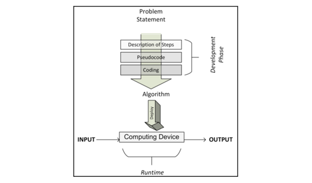
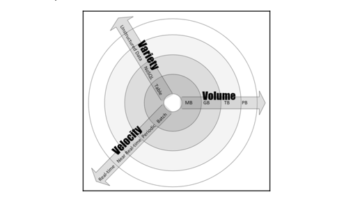
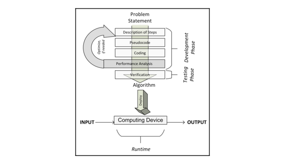

# Overview of Algorithms

## What is an algorithm?

- An algorithm is a set of rules for carrying out some calculations to solve a problem.
- It is designed to yield results for any valid input according to precisely defined instructions.

### The phases of an algorithm

1. _**Understanding the requirements from the problem statement**_
2. _**Development phase**_
    - **The design phase** _(Important phase)_
        - The _architecture_, _logic_ and _implementation_ details are documented
        - Finding and comparing different candidate algorithms
        - Carefully making a choice
    - **The coding phase**
        - Convert the designed algorithm into a computer program
        - Implement all the logic and architecture designed in the design phase
3. _**Deployment phase**_: Deploying an algorithm involves the design of the actual production environment

## Algorithm design techniques

- Keep three design concerns in mind:
    - **Concern 1:** Is this algorithm producing the result we expected?
    - **Concern 2:** Is this the most optimal way to get these results?
    - **Concern 3:** How is the algorithm going to perform on larger datasets?
- The algorithms can be divided into the following types based on the characteristics of the problem:
    - **Data-intensive algorithms**: are designed to deal with a large amount of data (A compression algorithm applied
      to a huge file).
    - **Compute-intensive algorithms**: have considerable processing requirements but do not involve large amounts of
      data.
    - **Both data and compute-intensive algorithms**: Deal with a large amount of data and have considerable computing
      requirements.
- Data dimension
    - **Volume**: The expected size of the data that the algorithm will process.
    - **Velocity**: The rate of new data generation when the algorithm is used.
    - **Variety**: How many types of data.
      
- Compute dimension
    - Is about the processing and computing needs of the problem at hand.
    - The processing requirements of an algorithm will determine what sort of design is most efficient for it.

## Performance analysis

- Analyzing the performance of an algorithm is an important part to estimate the performance and to analyze complexity.
- Any algorithm should have three key features:
    - Correct
    - Understandable
    - Efficient
- Two types of analysis the complexity of an algorithm:
    - **Space complexity analysis**: Estimate the runtime memory requirements needed to execute the algorithm.
    - **Time complexity analysis**: Estimate the time the algorithm will take to run.

## Estimating the performance

- The performance of a typical algorithm will depend on the type of the data given to it as an input.
- We have different types of cases to consider when conducting a performance analysis
    - **The best case**
        - The data given as input is organized in a way that the algorithm will give its best performance.
        - Best case analysis gives _the upper bound_ of the performance.
    - **The worst case**
        - The second way to estimate the performance of an algorithm is to try to find maximum possible time it will
          take to
          get the job done under a give set of conditions.
        - Guaranteeing that regardless of the conditions, the performance of the algorithm will always be better than
          the
          numbers that come out of our analysis.
        - Worst-case analysis is especially useful for estimating the performance when dealing with complex problems
          with
          larger datasets.
        - Worst-case analysis gives _the lower bound_ of the performance of the algorithm.
    - **The average case**
        - Dividing the various possible inputs into various groups. Then it conducts the performance analysis from one
          of
          the representative inputs from each group. Finally, it calculates the average of the performance of each of
          the groups.
        - Average-case analysis is _not always accurate_ as it needs to consider all the different combinations and
          possibilities of input to the algorithm, which is not always easy to do.

## Selecting an algorithm

- **Time complexity** and **Big O notation** are perfect tools for selecting an algorithm.

### Big O notation

- Big O notation is used to quantify the performance of various algorithms as the input size grows.
- It's one of the most popular methodologies used to conduct worst-case analysis.
- Different kinds:
    - **Constant time complexity O(1)**: an algorithm takes the same amount of time to run, independent of the size of
      the
      input data.
    - **Linear time complexity O(n)**: an algorithm is said to have a complexity of linear time, if the execution time
      is directly proportional to the size of the input.
    - **Quadratic time complexity O(n2)**: an algorithm is said to run in quadratic time if the execution time is
      proportional
      to the square of the input size.
    - **Logarithmic time complexity O(log n)**: an algorithm is said to run in logarithmic time if the execution time is
      proportional to the logarithm of the input size.
- One way to reduce the complexity of an algorithm is to compromise on its accuracy, producing a type of algorithm
  called
  an **_approximate algorithm_**
- The performance evaluation is iterative in nature
  

## Validating an algorithm

- Validating an algorithm confirms that it is actually providing a mathematical solution to the problem we are trying to
  solve.
- A validation process should check the results for as many possible values and types of inputs as possible.

### Exact, approximate, and randomized algorithms

- Validating an algorithm depends on the type of the algorithm as the testing techniques are different.
    - **Deterministic algorithms**: A particular input always generates exactly the same output.
    - **Randomized algorithms**: A sequence of random numbers is taken as input, which makes the output different each
      time
      the algorithm is run.
- Algorithms can be divided into two types based on assumptions or approximation used to simplify the logic to make them
  run faster
    - **An exact algorithm**: expected to produce a precise solution without introducing any assumptions or
      approximations.
    - **An approximate algorithm**: simplify the problem by making some assumptions. The algorithms based on these
      simplifications
      or assumptions are called _approximate algorithms_, which doesn't quite give us the precise solution.

