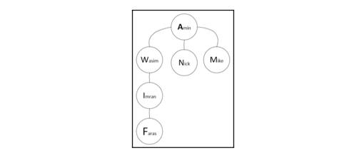
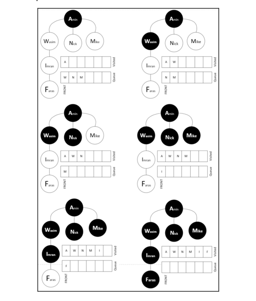
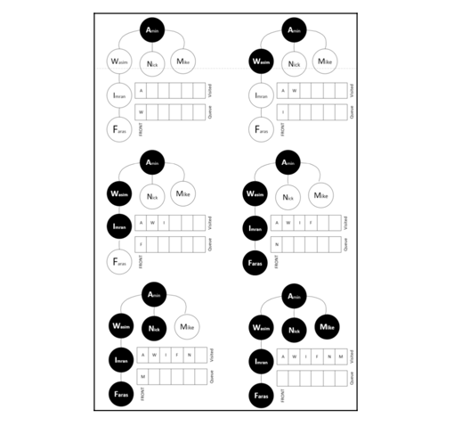
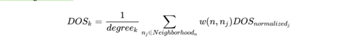

# Graph Algorithms

- There is a class of computational problems that can be best represented in terms of graphs. Such problems can be
  solved using a class of algorithms called **graph algorithms**.
- Using graph algorithms is one of the most efficient ways of searching for information in complex, interconnected data
  structures that are linked through meaning full relationships.
- In the era of big data, social media, and distributed data, such techniques are becoming increasingly important and
  useful.

## Representations of graphs

- A graph is a structure that represents data in terms of vertices and edges. A graph is represented
  as `aGraph = (𝓥, 𝓔)`, where `𝓥` represents a set of vertices and `𝓔` represents a set of edges. Note that `aGraph`
  has `|𝓥|` vertices and `|𝓔|` edges.
- A vertex, `𝓋 ∈ 𝓥`, represents a real-world object, such as a person, a computer, or an activity. An edge, `𝓋 ∈ 𝓔`,
  connects two vertices in a network:
    - `e(𝓋1, 𝓋2)|(e ∈ 𝓔) & (𝓋i ∈ 𝓥)`
- The preceding equation indicates that in a graph, all edges belong to a set `𝓔`, and all vertices belong to a set `𝓥`.

### Types of graphs

- Graphs can be classified into four kinds, namely the following:
    - Undirected graphs
    - Directed graphs
    - Undirected multi-graphs
    - Directed multi-graphs

#### Undirected graphs

- In most cases, the relationships that the constituent nodes of a graph represent can be thought of as undirectional.
- Such relationships do not impose any order on the relationship. Such edges are called **undirected edges** and the
  resultant graph is called an **undirected graph**

- For example:
    - Mike and Annie know each other
    - Node **A** and Node **B** are connected (this is a peer-to-peer connection)

#### Directed graphs

- A graph where the relationship between the nodes in the graph has some sense of direction is called a **directed graph
  **.
  
- For example
    - Mike and his house (Mike lives in a house, but his house does not live in Mike)
    - John manages Paul (John is manager of Paul)

#### Undirected multi-graphs

- Nodes have more than one type of relationship between them. In that case, there can be more than one edge connecting
  the same two nodes.
- These kinds of graphs, where multiples parallel edges are allowed on the same nodes, are called **multigraphs**. We
  have to explicitly indicate whether a particular graph is a multigraph or not. Parallel edges may represent different
  types of relationships between the nodes.
  
- For example, Mike and John are classmates are well as co-workers.

#### Directed multi-graphs

- If there is a directional relationship between nodes in a multigraph, we call it a **directed multigraph**.
  
- For example, Mike reports to John in the office, and John teaches Mike the Python programming language.

### Special types of edges

- Edges connect various vertices of a graph together and represent the relationship between themselves. In addition to
  simple edges, they can be of the following special types:
    - **Self-edge**: A particular vertex can have a relationship with itself. For example, John transfer money from his
      business account to his personal account. Such a special relationship can be represented by a self-directed edge.
    - **Hyper-edge**: More than one vertex is connected by the same edge. An edge that connects more than one vertex to
      represent such a relationship is called a hyper-edge. For example, suppose all three of Mike, John, and Sarah are
      working on one specific project.
      

### Ego-centered networks

- The direct neighborhood of a particular vertex, `m`, may have enough important information to conduct a conclusive
  analysis for the node. The ego-center, or ego-net, is based on this idea. An ego-net of a particular vertex, `m`,
  consists of all the vertices directly connected to `m` plus node `m` itself. The node `m` is called the **ego** and
  the one-hop neighbors it is connected to are called **alters**.
- Note that the ego-net represents one degree neighborhood. This concept can be extended to n-degree neighborhoods,
  which consist of all the vertices n-hop away from the vertex of interest.
  

### Social network analysis

- **Social network analysis (SNA)** is one of the important applications of graph theory.
- A network graph analysis is considered social network analysis if the following apply:
    - The vertices of the graph represent people.
    - The edges between them represent social relationships between them, such as a friendship, a common hobby, and so
      on.
    - The business question that we are trying to answer through graph analysis has some strong social aspect to it.
- Human behavior is reflected in SNA and should always be kept in mind while working on SNA. By mapping human
  relationships in a graph, SNA gives good insights into human interactions, which can help us understand their actions.
- By creating a neighborhood around each individual and analyzing the actions of an individual based on its social
  relationship, you can produce interesting, and sometimes surprising, insights. The alternative approaches to analyzing
  individuals in isolation, based on their individual job functions, can only provide limited insights.
- So, SNA can be used for the following:
    - Understanding a user's actions on social media platforms, such as Facebook, Twitter, or LinkedIn.
    - Understanding fraud.
    - Understanding society's criminal behavior.

## Introducing network analysis theory

- We know that interconnected data can be represented as a network. In network analysis theory, we study the details of
  the methodologies developed to explore and analyze data represented as a network.
- Let's look at some of the important concepts used in network analysis theory.

### Understanding the shortest path

- A path is a sequence of nodes between a start node and an end node, where no node appears twice on the path. A path
  represents a route between the chosen start and end vertex. It will be set of vertices, `p`, connecting the start
  vertex with the end vertex. No vertex is repeated in `p`.
- The length of the path is calculated by counting the constituent edges, the path with the smallest length is called
  the **shortest path**.
- There is an algorithm to find the shortest path, **Dijkstra's algorithm**.

### Creating a neighborhood

- Finding strategies to create a neighborhood around nodes of interest is pivotal for graph algorithms.
- The various criteria for creating neighborhoods.

#### Triangles

- In graph theory, finding vertices that are well-connected to each other is important for the purpose of analysis.
- One technique is to try to identify triangles, which are a subgraph that consists of three nodes directly connected to
  each other in the network.

#### Density

- We call a graph where every vertex is directly connected to every other vertex a **fully connected network**.
- If we have a fully connected network, `N`, the number of edges in the network can be represented by the following:
  
- Density measures the number of observed edges to the maximum number of edges.
  

### Understanding centrality measures

- There are different measures for understanding the centrality of a particular vertex in a graph or subgraph.
- The following centrality measures are widely used in graph analysis:
    - Degree
    - Betweenness
    - Closeness
    - Eigenvector

#### Degree

- The number of edges connected to a particular vertex is called its **degree**. It can indicate how well-connected a
  particular vertex is and its ability to quickly spread a message across a network.
- Let's consider `aGraph = (𝓥, 𝓔)`, where `𝓥` represents a set of vertices and `𝓔` represents a set of edges. Recall
  that `aGraph` has `|𝓥|` vertices and `|𝓔|` edges. If we divide the degree of a node by `(|𝓥| -1)`, it is called *
  *degree centrality**
  

#### Betweenness

- Betweenness is the measure of centrality in a graph. In the context of social media, it will quantify the probability
  that a person is part of the communication in a subgroup.
- For a computer network, betweenness will quantify the negative effect on communication between the graph nodes, in the
  event of vertex failure.
- To calculate the betweenness of vertex `a` in a certain `aGraph`.
    - We first calculate the shortest path between each pair of vertices. (marked as `A`)
    - Then, calculate the shortest path that pass through vertex `a`. (marked as `B`)
    - Finally, we divide `B` by `A`. We have the betweenness of vertex `a`.

#### Fairness and Closeness

- Let's take `a` graph, `g`. The fairness of vertex `a` in graph `g` is defined as the sum of vertex `a`'s distance from
  other vertices. Note that the centrality of a particular vertex quantifies its total distance from all the other
  vertices.
- The opposite of fairness is closeness.

#### Eigenvector

- Eigenvector centrality gives scores to all vertices in a graph that measure their importance in the network.
- The score will be an indicator of the connectivity of a particular node to other important nodes in the whole network.

### Calculating centrality metrics using Python

- Reference: [Centrality metrics](centrality_metrics.py)

## Understanding graph traversals

- To make use of graphs, information needs to be mined from them. Graph traversal is defined as the strategy used to
  make sure that every vertex and edge is visited in an orderly manner.
- An effort is made to make sure that each vertex and edge is visited exactly once.
- There can be two different ways of traveling a graph to search the data in it.
    - **Breadth-first search (BFS)**
    - **Depth-first search (DFS)**

### Breadth-first search

- BFS works best when there is a concept of layers of levels of neighborhoods in the graph.
- BFS starts from a root vertex and explores the vertices in the neighborhood vertices. It then moves to the next
  neighborhood level and repeats the process.
  
- How the algorithm works:
    - It starts from the first node, which is the only node, **Amin**, on level one.
    - Then, it moves to level two and visits all three nodes **Wasim**, **Nick**, and **Mike** one by one.
    - After that, it moves to level three and level four, which have only one node each, **Imran** and **Faras**.
    - Once all the nodes have been visited, they are added to the **Visited** data structure and the iteration stop:
      

### Depth-first search

- DFS is the alternative to BFS, used to search data from a graph. The factor that differentiates DFS from BFS is that
  after starting from the root vertex, the algorithm goes down as far as possible in each of the unique single paths one
  by one.
- For each path, once it has successfully reached the ultimate depth, it flags all the vertices associated with that
  path as visited.
- After completing the path, the algorithm backtracks. If it can find another path from the root node that has yet to be
  visited, the algorithm repeats the previous process. The algorithm keeps on moving in the new branch until all the
  branches have been visited.
- How the DFS works to solve the above example:
    - The iteration starts from the top node, **Amin**.
    - Then, it moves to level two, **Wasim**. From there, it moves toward the lower levels until it reaches the end,
      which is the **Imran** and **Fares** nodes.
    - After completing the first full branch, it backtracks and then goes to level two to visit **Nick** and **Mike**.
      

## Case study - fraud analytics

- Note that we have already conducted detailed analysis to classify each node as a graph or non-graph. Let's assume that
  we add another vertex, named q, to the network, as shown in the following figure. We have no prior information about
  this person and whether this person is involved in fraud or not. We want to classify this person as NF or F based on
  their links to the existing members of the social network.
- We have devised two ways to classify this new person, represented by node q, as F or NF:
    - Using a simple method that does not use centrality metrics and additional information about the type of fraud.
    - Using a watchtower methodology, which is an advanced technique that uses the centrality metrics of the existing
      nodes, as well as additional information about the type of fraud

### Conducting simple fraud analytics

- The simple technique of fraud analytics is based on the assumption that in a network, the behaviour of a person is
  affected by the people they are connected to.
- In a network, two vertices are more likely to have similar behaviour if they are associated with each other.
- Based on this assumption, we devise a simple technique. If we want to find the probability that a certain node, `a`,
  belongs to `F`, the probability is represented by `P(F/q)` and is calculated as follows:
  
- Note that this process needs to be repeated for each of the new nodes in the network.
- Two limitations:
    - It does not evaluate the importance of each vertex in the social network. A connection to a hub that is involved
      in fraud may have different implications than a relationship with a remote, isolated person.
    - When labeling someone as a known case of fraud in an existing network, we do not consider the severity of the
      crime.

### Presenting the watchtower fraud analytics methodology

- The watchtower fraud analytics methodology addresses these two limitations.

#### Scoring negative outcomes

- If a person is known to be involved in fraud, we say that there is a negative outcome associated with this individual.

#### Degree of suspicion

- The degree of suspicion (DOS) quantifies our level of suspicion that a person may be involved in fraud. A DOS value of
  0 means that this is a low-risk person and a DOS value of 9 means that this is a high-risk person.
- In order to calculate the DOS of the new node that has the following formula:
  
