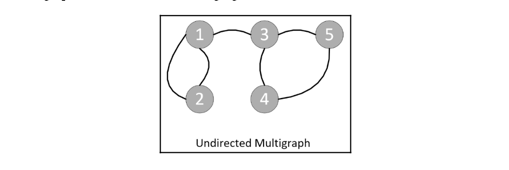
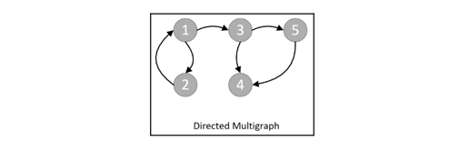
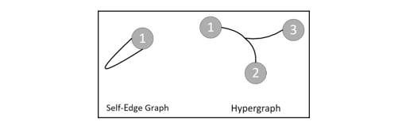
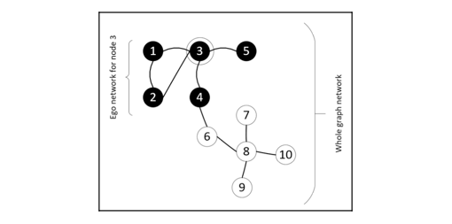

# Graph Algorithms
- There is a class of computational problems that can be best represented in terms of graphs. Such problems can be solved using a class of algorithms called **graph algorithms**.
- Using graph algorithms is one of the most efficient ways of searching for information in complex, interconnected data structures that are linked through meaning full relationships.
- In the era of big data, social media, and distributed data, such techniques are becoming increasingly important and useful.

## Representations of graphs
- A graph is a structure that represents data in terms of vertices and edges. A graph is represented as `aGraph = (𝓥, 𝓔)`, where `𝓥` represents a set of vertices and `𝓔` represents a set of edges. Note that `aGraph` has `|𝓥|` vertices and `|𝓔|` edges.
- A vertex, `𝓋 ∈ 𝓥`, represents a real-world object, such as a person, a computer, or an activity. An edge, `𝓋 ∈ 𝓔`, connects two vertices in a network:
  - `e(𝓋1, 𝓋2)|(e ∈ 𝓔) & (𝓋i ∈ 𝓥)`
- The preceding equation indicates that in a graph, all edges belong to a set `𝓔`, and all vertices belong to a set `𝓥`.

### Types of graphs
- Graphs can be classified into four kinds, namely the following:
  - Undirected graphs
  - Directed graphs
  - Undirected multi-graphs
  - Directed multi-graphs
#### Undirected graphs
- In most cases, the relationships that the constituent nodes of a graph represent can be thought of as undirectional.
- Such relationships do not impose any order on the relationship. Such edges are called **undirected edges** and the resultant graph is called an **undirected graph**

- For example:
  - Mike and Annie know each other
  - Node **A** and Node **B** are connected (this is a peer-to-peer connection)

#### Directed graphs
- A graph where the relationship between the nodes in the graph has some sense of direction is called a **directed graph**.

- For example
  - Mike and his house (Mike lives in a house, but his house does not live in Mike)
  - John manages Paul (John is manager of Paul)

#### Undirected multi-graphs
- Nodes have more than one type of relationship between them. In that case, there can be more than one edge connecting the same two nodes.
- These kinds of graphs, where multiples parallel edges are allowed on the same nodes, are called **multigraphs**. We have to explicitly indicate whether a particular graph is a multigraph or not. Parallel edges may represent different types of relationships between the nodes.

- For example, Mike and John are classmates are well as co-workers.

#### Directed multi-graphs
- If there is a directional relationship between nodes in a multigraph, we call it a **directed multigraph**.

- For example, Mike reports to John in the office, and John teaches Mike the Python programming language.

### Special types of edges
- Edges connect various vertices of a graph together and represent the relationship between themselves. In addition to simple edges, they can be of the following special types:
  - **Self-edge**: A particular vertex can have a relationship with itself. For example, John transfer money from his business account to his personal account. Such a special relationship can be represented by a self-directed edge.
  - **Hyper-edge**: More than one vertex is connected by the same edge. An edge that connects more than one vertex to represent such a relationship is called a hyper-edge. For example, suppose all three of Mike, John, and Sarah are working on one specific project.

### Ego-centered networks
- The direct neighborhood of a particular vertex, `m`, may have enough important information to conduct a conclusive analysis for the node. The ego-center, or ego-net, is based on this idea. An ego-net of a particular vertex, `m`, consists of all the vertices directly connected to `m` plus node `m` itself. The node `m` is called the **ego** and the one-hop neighbors it is connected to are called **alters**.
- Note that the ego-net represents one degree neighborhood. This concept can be extended to n-degree neighborhoods, which consist of all the vertices n-hop away from the vertex of interest.

### Social network analysis
- **Social network analysis (SNA)** is one of the important applications of graph theory.
- A network graph analysis is considered social network analysis if the following apply:
  - The vertices of the graph represent people.
  - The edges between them represent social relationships between them, such as a friendship, a common hobby, and so on.
  - The business question that we are trying to answer through graph analysis has some strong social aspect to it.
- Human behavior is reflected in SNA and should always be kept in mind while working on SNA. By mapping human relationships in a graph, SNA gives good insights into human interactions, which can help us understand their actions.
- By creating a neighborhood around each individual and analyzing the actions of an individual based on its social relationship, you can produce interesting, and sometimes surprising, insights. The alternative approaches to analyzing individuals in isolation, based on their individual job functions, can only provide limited insights.
- So, SNA can be used for the following:
  - Understanding a user's actions on social media platforms, such as Facebook, Twitter, or LinkedIn.
  - Understanding fraud.
  - Understanding society's criminal behavior.

## Introducing network analysis theory
- We know that interconnected data can be represented as a network. In network analysis theory, we study the details of the methodologies developed to explore and analyze data represented as a network.
- Let's look at some of the important concepts used in network analysis theory.
### Understanding the shortest path
- A path is a sequence of nodes between a start node and an end node, where no node appears twice on the path. A path represents a route between the chosen start and end vertex. It will be set of vertices, `p`, connecting the start vertex with the end vertex. No vertex is repeated in `p`.
- The length of the path is calculated by counting the constituent edges, the path with the smallest length is called the **shortest path**.
- There is an algorithm to find the shortest path, **Dijkstra's algorithm**.

### Creating a neighborhood
- Finding strategies to create a neighborhood around nodes of interest is pivotal for graph algorithms.
- The various criteria for creating neighborhoods.

#### Triangles
- In graph theory, finding vertices that are well-connected to each other is important for the purpose of analysis.
- One technique is to try to identify triangles, which are a subgraph that consists of three nodes directly connected to each other in the network.
#### Density
- We call a graph where every vertex is directly connected to every other vertex a **fully connected network**.
- If we have a fully connected network, `N`, the number of edges in the network can be represented by the following:

- Density measures the number of observed edges to the maximum number of edges.

### Understanding centrality measures
- There are different measures for understanding the centrality of a particular vertex in a graph or subgraph.
- The following centrality measures are widely used in graph analysis:
  - Degree
  - Betweenness
  - Closeness
  - Eigenvector

#### Degree
- The number of edges connected to a particular vertex is called its **degree**. It can indicate how well-connected a particular vertex is and its ability to quickly spread a message across a network.
- Let's consider `aGraph = (𝓥, 𝓔)`, where `𝓥` represents a set of vertices and `𝓔` represents a set of edges. Recall that `aGraph` has `|𝓥|` vertices and `|𝓔|` edges. If we divide the degree of a node by `(|𝓥| -1)`, it is called **degree centrality**

#### Betweenness
- Betweenness is the measure of centrality in a graph. In the context of social media, it will quantify the probability that a person is part of the communication in a subgroup.
- For a computer network, betweenness will quantify the negative effect on communication between the graph nodes, in the event of vertex failure.
- To calculate the betweenness of vertex `a` in a certain `aGraph`. 
  - We first calculate the shortest path between each pair of vertices. (marked as `A`)
  - Then, calculate the shortest path that pass through vertex `a`. (marked as `B`)
  - Finally, we divide `B` by `A`. We have the betweenness of vertex `a`.

#### Fairness and Closeness
- Let's take `a` graph, `g`. The fairness of vertex `a` in graph `g` is defined as the sum of vertex `a`'s distance from other vertices. Note that the centrality of a particular vertex quantifies its total distance from all the other vertices.
- The opposite of fairness is closeness.

#### Eigenvector
- Eigenvector centrality gives scores to all vertices in a graph that measure their importance in the network.
- The score will be an indicator of the connectivity of a particular node to other important nodes in the whole network.

### Calculating centrality metrics using Python

## Understanding graph traversals

## Case study - fraud analytics

