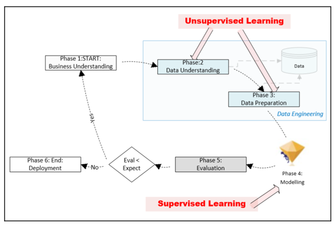
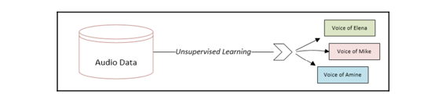

# Unsupervised Machine Learning Algorithms

## Introducing unsupervised learning

- The simplest definition of unsupervised learning is that it is the process of providing some sort of structure to
  unstructured data by discovering and utilizing the inherent patterns of the data.
- If data is not produced by some random process, it will have some patterns between its data elements in its
  multidimensional problem space.
- Unsupervised learning algorithms work by discovering these patterns and using them to provide some structure to the
  dataset
  

### Unsupervised learning in the data-mining lifecycle

- To understand the role of unsupervised learning, it is important to first look at the overall lifecycle of the
  data-mining process. There are different methodologies that divide the lifecycle of the data-mining into different
  independent stages, called **phases**.
- There are two popular ways to represent the data-mining lifecycle:
    - **CRISP-DM (Cross-Industry Standard Process for Data Mining)** lifecycle
    - **SEMMA (Sample, Explore, Modify, Model, Access)** data-mining process
- If we look at the CRISP-DM lifecycle, we can see that it consists of six distinct phases, which are shown in the
  following figure:
  
- Let's understand each phase one by one:
    - **Phase 1: Business Understanding**
        - This is about gathering the requirements and involves trying to fully understand the problem in depth from a
          business point of view.
        - Defining the scope of the problem and property rephrasing it accordingly to **machine learning (ML)** is an
          important part of this phase.
    - **Phase 2: Data Understanding**
        - This is about understanding the data that is available for data mining. In this phase, we will find out
          whether the right datasets are available for the problem we are trying to solve.
        - After identifying the datasets, we need to understand the quality of the data and its structure. We need to
          find out what patterns can be extracted out of the data that can potentially lead us toward important
          insights.
        - We will also try to find the right feature that can be used as the label according to the requirements
          gathered in Phase 1.
        - UL algorithms can play a powerful role in achieving the objectives of Phase 2.
        - It can be used for these purposes:
            - To discover patterns in the dataset
            - To understand the structure of the dataset by analyzing the discovered patterns
            - To identify or derive the target variable
    - **Phase 3: Data Preparation**
        - This is about preparing the data for the ML model that we will train in Phase 4. The available labeled data is
          divided into two unequal parts.
        - The larger portion is called the **training data** and is used for training the model downstream in Phase 4.
        - The smaller portion is called the **testing data** and is used in Phase 5 for model evaluation.
        - In this phase, the unsupervised machine learning algorithms can be used as a tool to prepare the data.
    - **Phase 4: Modeling**
        - This is the phase where we use supervised learning to formulate the patterns that we have discovered. We are
          expected to successfully prepare the data according to the requirements of our chosen supervised learning
          algorithm.
        - This is also the phase in which the particular feature that will be used as the label will be identified.
        - In Phase 3, we divided the data into testing and training sets. In this phase, we form mathematical
          formulations to represent the relationships in our patterns of interest. This is done by training the model
          using the training data that was created in Phase 3. As mentioned before, the resulting mathematical
          formulation will depend on our choice of algorithm.
    - **Phase 5: Evaluation**
        - This phase is about testing the newly trained model using the test data from Phase 3.
        - If the evaluation matches the expectations set in Phase 1, then we need iterate through all the preceding
          phases again, starting with Phase 1. This is illustrated in the preceding image.
    - **Phase 6: Deployment**
        - If the evaluation meets or exceeds the expectations described in Phase 5, then the trained model is deployed
          in production and starts generating a solution to the problem we defined in Phase 1.

### Practical examples

1. Voice categorization

- For example, let's assume that we have a recorded conversation of three people talking to each other for half an hour.
  Using unsupervised learning algorithms, we can identify the voices of distinct people in this dataset. Note that
  through unsupervised learning, we are adding structure to the given set of unstructured data. This structure gives us
  additional useful dimensions in our problem space that can be used to gain insights and to prepare data for our chosen
  machine learning algorithm. The following diagram shows how unsupervised learning is used for voice recognition:
  
  Note that, in this case, unsupervised learning suggests that we add a new feature with three distinct levels.

2. Document categorization

- Unsupervised machine learning algorithms can also be applied to a repository of unstructured textual data—for example,
  if we have a dataset of PDF documents, then unsupervised learning can be used to do the following:
    - Discover various topics in the dataset
    - Associate each PDF document to one of the discovered topics
      
      Note that, in this case, unsupervised learning suggests that we add a new feature with five distinct levels.

## Understanding cluster algorithms

### Quantifying similarities

### Hierarchical clustering

### Evaluating the clusters

### Application of clustering

## Dimensionality reduction

## Association rules mining

## Practical application - Clustering similar tweets together

## Anomaly - detection algorithms