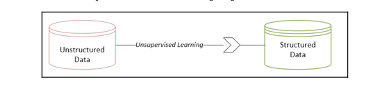

# Unsupervised Machine Learning Algorithms

## Introducing unsupervised learning

- The simplest definition of unsupervised learning is that it is the process of providing some sort of structure to
  unstructured data by discovering and utilizing the inherent patterns of the data.
- If data is not produced by some random process, it will have some patterns between its data elements in its
  multidimensional problem space.
- Unsupervised learning algorithms work by discovering these patterns and using them to provide some structure to the
  dataset
  

### Unsupervised learning in the data-mining lifecycle

### Current research trends in unsupervised learning

## Understanding cluster algorithms

### Quantifying similarities

### Hierarchical clustering

### Evaluating the clusters

### Application of clustering

## Dimensionality reduction

## Association rules mining

## Practical application - Clustering similar tweets together

## Anomaly - detection algorithms