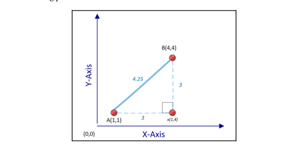
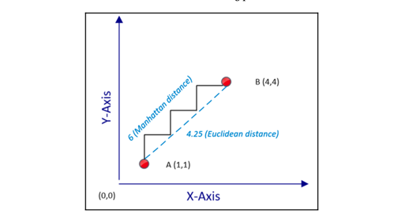
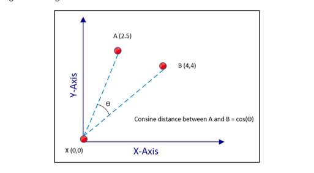
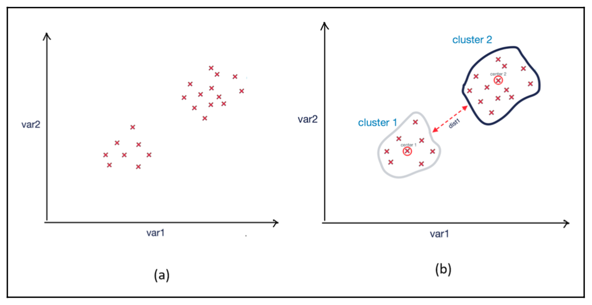
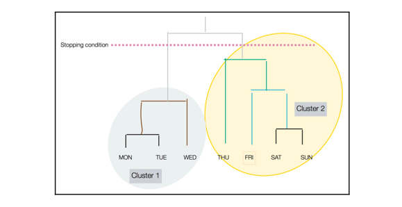
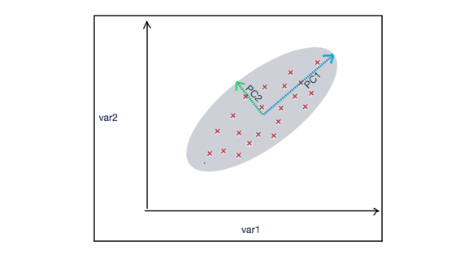
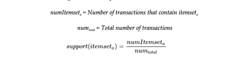
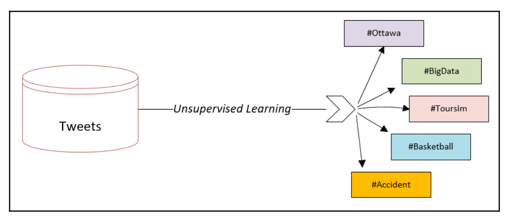

# Unsupervised Machine Learning Algorithms

## Introducing unsupervised learning

- The simplest definition of unsupervised learning is that it is the process of providing some sort of structure to
  unstructured data by discovering and utilizing the inherent patterns of the data.
- If data is not produced by some random process, it will have some patterns between its data elements in its
  multidimensional problem space.
- Unsupervised learning algorithms work by discovering these patterns and using them to provide some structure to the
  dataset
  

### Unsupervised learning in the data-mining lifecycle

- To understand the role of unsupervised learning, it is important to first look at the overall lifecycle of the
  data-mining process. There are different methodologies that divide the lifecycle of the data-mining into different
  independent stages, called **phases**.
- There are two popular ways to represent the data-mining lifecycle:
    - **CRISP-DM (Cross-Industry Standard Process for Data Mining)** lifecycle
    - **SEMMA (Sample, Explore, Modify, Model, Access)** data-mining process
- If we look at the CRISP-DM lifecycle, we can see that it consists of six distinct phases, which are shown in the
  following figure:
  
- Let's understand each phase one by one:
    - **Phase 1: Business Understanding**
        - This is about gathering the requirements and involves trying to fully understand the problem in depth from a
          business point of view.
        - Defining the scope of the problem and property rephrasing it accordingly to **machine learning (ML)** is an
          important part of this phase.
    - **Phase 2: Data Understanding**
        - This is about understanding the data that is available for data mining. In this phase, we will find out
          whether the right datasets are available for the problem we are trying to solve.
        - After identifying the datasets, we need to understand the quality of the data and its structure. We need to
          find out what patterns can be extracted out of the data that can potentially lead us toward important
          insights.
        - We will also try to find the right feature that can be used as the label according to the requirements
          gathered in Phase 1.
        - UL algorithms can play a powerful role in achieving the objectives of Phase 2.
        - It can be used for these purposes:
            - To discover patterns in the dataset
            - To understand the structure of the dataset by analyzing the discovered patterns
            - To identify or derive the target variable
    - **Phase 3: Data Preparation**
        - This is about preparing the data for the ML model that we will train in Phase 4. The available labeled data is
          divided into two unequal parts.
        - The larger portion is called the **training data** and is used for training the model downstream in Phase 4.
        - The smaller portion is called the **testing data** and is used in Phase 5 for model evaluation.
        - In this phase, the unsupervised machine learning algorithms can be used as a tool to prepare the data.
    - **Phase 4: Modeling**
        - This is the phase where we use supervised learning to formulate the patterns that we have discovered. We are
          expected to successfully prepare the data according to the requirements of our chosen supervised learning
          algorithm.
        - This is also the phase in which the particular feature that will be used as the label will be identified.
        - In Phase 3, we divided the data into testing and training sets. In this phase, we form mathematical
          formulations to represent the relationships in our patterns of interest. This is done by training the model
          using the training data that was created in Phase 3. As mentioned before, the resulting mathematical
          formulation will depend on our choice of algorithm.
    - **Phase 5: Evaluation**
        - This phase is about testing the newly trained model using the test data from Phase 3.
        - If the evaluation matches the expectations set in Phase 1, then we need iterate through all the preceding
          phases again, starting with Phase 1. This is illustrated in the preceding image.
    - **Phase 6: Deployment**
        - If the evaluation meets or exceeds the expectations described in Phase 5, then the trained model is deployed
          in production and starts generating a solution to the problem we defined in Phase 1.

### Practical examples

1. Voice categorization

- For example, let's assume that we have a recorded conversation of three people talking to each other for half an hour.
  Using unsupervised learning algorithms, we can identify the voices of distinct people in this dataset. Note that
  through unsupervised learning, we are adding structure to the given set of unstructured data. This structure gives us
  additional useful dimensions in our problem space that can be used to gain insights and to prepare data for our chosen
  machine learning algorithm. The following diagram shows how unsupervised learning is used for voice recognition:
  
  Note that, in this case, unsupervised learning suggests that we add a new feature with three distinct levels.

2. Document categorization

- Unsupervised machine learning algorithms can also be applied to a repository of unstructured textual data—for example,
  if we have a dataset of PDF documents, then unsupervised learning can be used to do the following:
    - Discover various topics in the dataset
    - Associate each PDF document to one of the discovered topics
      
      Note that, in this case, unsupervised learning suggests that we add a new feature with five distinct levels.

## Understanding cluster algorithms

- One of the simplest and most powerful techniques used in unsupervised learning is based on grouping similar patterns
  together through clustering algorithms. It is used to understand a particular aspect of the data that is related to
  the problem.
- Clustering algorithms look for natural grouping in data items. As the group is not based on any target or assumptions,
  it is classified as as an unsupervised learning technique.
- Grouping created by various clustering algorithms are based on _**finding the similarities**_ between various data
  points
  in the problem space. The best way to determine the similarity between data points will vary from problem and will
  depend on the nature of the problem we are dealing with.

### Quantifying similarities

- The reliability of the grouping created by clustering algorithms is based on the assumption that we can accurately
  quantify the similarities or closeness between various data points in the problem space.
- Three of the most popular methods that are used to quantify similarities:
    - Euclidean distance measure
    - Manhattan distance measure
    - Cosine distance measure

#### Euclidean distance measure

- The distance between different points can quantify the similarity between two data points and is extensively used in
  unsupervised machine learning techniques, such as clustering.
- Euclidean distance is the most common and simple distance measure used. It is calculated by measuring the shortest
  distance between two data points in multi-dimensional space.
- For `n`-dimensional problem space, we can calculate the distance between two points **A** and **B** as follows:
  

#### Manhattan distance

- In many situations, measuring the distance between two points using Euclidean distance measure will not truly
  represent the similarity or closeness between two points. For example, if two data points represent locations on a
  map, then the actual distance between them using ground transportation will be more than the distance calculated by
  the Euclidean distance.
- For situations such as these, we use Manhattan distance, which **marks the longest route** between two points and is a
  better reflection of the closeness of two points in the context of source and destination points that can be traveled
  to in a busy city.
- The Manhattan distance will always be equal or larger than the corresponding Euclidean distance calculated.

#### Cosine distance

- Euclidean and Manhattan distance measures do not perform well in high-dimensional space. In a high-dimensional problem
  space, cosine distance more accurately reflects the closeness between two data points in a multi-dimensional problem
  space.
- The cosine distance measure is calculated by measuring the cosine angle created by two points connected to a reference
  point.
- If the data points are close, then the angle will be narrow, on the other hand, if they are far away, then the angle
  will be larger.
- Textual data can almost be considered a highly dimensional space. As the cosine distance measure works very well with
  h-dimensional spaces, it is a good choice when dealing with textual data.
- Any point in the problem space can act as the reference data point, and it does not have to be the origin.

#### K-means clustering algorithm

- The name of the k-means clustering algorithm comes from the fact that it tries to create a number of clusters, `k`,
  calculating the means to find the closeness between the data points. It uses a relatively simple clustering approach,
  but it still popular because of its scalability and speed. Algorithmically, k-means clustering uses an iterative logic
  that moves the centers of the clusters until they reflect the most representative data point of the grouping they
  belong to.
- It is important to note that k-means algorithm lack one of the very basic functionalities needed for clustering.
    - That missing functionality is that for a given dataset, the k-means algorithm cannot determine the most
      appropriate number of clusters.
    - The most appropriate number of clusters, `k`, is dependent on the number of natural groupings in a particular
      dataset.
    - The philosophy behind here is to keep the algorithm as simple as possible, maximizing its performance.
    - The best way to determine `k` will depend on the problem we are trying to solve.

#### The logic of k-means clustering

##### Initialization

- In order to group them, the k-means algorithm uses a distance measure to find the similarity or closeness between data
  points. Before using the k-means algorithm, the most appropriate distance measure needs to be selected.
- By default, the Euclidean distance measure will be used. If the dataset has outliers, then a mechanism needs to be
  devised to determine the criteria that are to be identified and remove the outliers of the dataset.

##### The steps of the k-means algorithm

The steps involved in the k-means clustering algorithm are as follows:

| Steps  | Description                                                                                                                                                                                                                                                                                                                                                                                                                                                                |
|--------|----------------------------------------------------------------------------------------------------------------------------------------------------------------------------------------------------------------------------------------------------------------------------------------------------------------------------------------------------------------------------------------------------------------------------------------------------------------------------|
| Step 1 | We choose the number of clusters, `k`.                                                                                                                                                                                                                                                                                                                                                                                                                                     |
| Step 2 | Among the data points, we randomly choose `k` points as cluster centers.                                                                                                                                                                                                                                                                                                                                                                                                   |
| Step 3 | Based on the selected distance measure, we iteratively compute the distance from each point in the problem space to each of the `k` cluster center. Based on the size of the dataset, this may be a time-consuming step.                                                                                                                                                                                                                                                   |
| Step 4 | We assign each data point in the problem space to the nearst cluster center.                                                                                                                                                                                                                                                                                                                                                                                               |
| Step 5 | Each data point in our problem space has an assigned cluster center. Bet we are not done, as the selection of the initial cluster centers was based on random selection. We need to verify that the current randomly selected cluster centers are actually the center of gravity of each cluster. We recalculate the cluster centers by computing the mean of the constituent data point of each the `k` cluster. This step explains why this algorithm is called k-means. |
| Step 6 | If the cluster centers have shifted in step 5, this means that we need to recompute the cluster assignment for each data point. For this, we will go back to step 3 to repeat that compute intensive step. If the cluster centers have not shifted or if our predetermined stop condition has been satisfied, the we are done.                                                                                                                                             |

##### Stop condition

- For the k-means algorithm, the default stop condition is when there is no more shifting of cluster centers in step 5.
  But as with many other algorithms, k-means algorithms may take lot of time to converge, especially while processing
  large datasets in a high-dimensional problem space. Instead of waiting for the algorithm to converge, we can also
  explicitly define the stop condition as follows:
    - By specifying the maximum execution time:
        - **Stop condition**: `t > t_max` where `t` is the current execution time and `t_max` is the maximum execution
          time we have set for the algorithm.
    - By specifying the maximum iteration:
        - **Stop condition**: if `m > m_max` where `m` is the current iteration and `m_max` is the maximum number of
          iterations we have set for the algorithm.

#### Coding the k-means algorithm

- Implementation: [K means algorithm](k_means.py)

#### Limitation of k-means clustering

- The k-means algorith is designed to be a simple and fast algorithm, because of the intentional similarity in its
  design, it comes with the following limitations:
    - The biggest limitation of the k-means clustering is that that initial number of clusters has to be
      _predetermined_.
    - The initial assignment of cluster centers is _random_. This means that each time the algorithm is run, it may give
      slightly different clusters.
    - Each data point is assigned to only _one cluster_.
    - k-means clustering is _sensitive to outliers_.

### Hierarchical clustering

- K-means clustering uses a top-down approach because we start the algorithm from the most important data points, which
  are the cluster centers.
- There is an alternative approach of clustering where, instead of starting from the top, we start the algorithm from
  the bottom. The bottom in this context is each of the individual data points in the problem space.
- The solution is to keep on grouping similar data points together as it progresses up toward the cluster centers.
- This alternative approach is used by hierarchical clustering algorithms.

#### Steps of hierarchical clustering

- The following steps are involved in hierarchical clustering:
    - **Step 1**: We create a separate cluster for each data point in our problem space. If our problem space consists
      of 100 data points, then it will start with 100 clusters.
    - **Step 2**: We group only those points that are closest to each other.
    - **Step 3**: We check for the stop condition, if the stop condition is not yet satisfied, then we repeat step 2.

- The resulting clustered structure is called a **dendrogram**. In a dendrogram, the height of the vertical lines
  determines how close the items are.
  

### Evaluating the clusters

- The objective of good quality clustering is that the data points that belong to the separate clusters should be
  differentiable. This implies the following:
    - The data points that belong to the same cluster should be as similar as possible.
    - Data points that belong to separate clusters should be as different as possible.
- Silhouette analysis is one such technique that compares the tightness and separation in the clusters created by the
  k-means algorithm.
- The silhouette draws a plot that displays the closeness each point in a particular cluster has with respect to the
  other points in the neighboring clusters. It associates a number in the range of `[-0, 1]` with each cluster. The
  following table shows what the figures in this range signify:

| Range       | Meaning                      | Description                                                                                                             |
|-------------|------------------------------|-------------------------------------------------------------------------------------------------------------------------|
| 0.71 - 1.0  | Excellent                    | This means that the k-means clustering resulted in groups that are quite differentiable from each other.                |
| 0.51 - 0.70 | Reasonable                   | This means that the k-means clustering resulted in groups that are somewhat differentiable from each other.             |
| 0.26 - 0.50 | Weal                         | This means that the k-means clustering resulted in grouping, but the quality of the grouping should not be relied upon. |
| < 0.25      | No clustering has been found | Using the parameters selected and the data used, it was not possible to create grouping using k-means clustering.       |

### Application of clustering

- Clustering is used wherever we needed to discover the underlying patterns in datasets.
- In government use cases, clustering can be used for the following:
    - Crime-hotspot analysis
    - Demographic social analysis
- In market research, clustering can be used for the following:
    - Market segmentation
    - Targeted advertisements
    - Customer Categorization
- **Principal component analysis (PCA)** is also used for generally exploring the data and removing noise from real-time
  data, such as stock-market trading.

## Dimensionality reduction

- Each feature in our data corresponds to a dimension in our problem space. Minimizing the number of features to make
  our problem space simpler is called **dimensionality reduction**. It can be done in one of the following two ways:
    - **Feature selection**: Selecting a set of features that are important in the context of the problem we are trying
      to solve.
    - **Feature aggregation**: Combining two or more features to reduce dimensions using one of the following
      algorithms:
        - **PCA**: A linear unsupervised ML algorithm
        - **Linear discriminant analysis (LDA)**: A linear supervised ML algorithm
        - **Kernel principal component analysis**: A nonlinear algorithm

### Principal components analysis

- PCA is an unsupervised ML technique that can be used to reduce dimensions using linear transformation. In the
  following figure, we can see two principal components, `PC1` and `PC2`, which show the shape of the spread of the data
  points. PC1 and PC2 can be used to summarize the data points with appropriate coefficients:

- Limitations
    - PCA can only be used for continuous variables and is not relevant for category variables.
    - While aggregating, PCA approximates the components variables; it simplifies the problem of dimensionality at the
      expense of accuracy. This trade-off should be carefully studied before using PCA.

## Association rules mining

- Patterns in a particular dataset are the treasure that needs to be discovered, understood, and mined for the
  information they contain. There is an important set of algorithms that try to focus on the pattern analysis in a given
  dataset. One of the more popular algorithms in this class of algorithm is called the **association rules mining
  algorithm**, which provides us with the following capabilities:
    - The ability to measure the frequency of a pattern.
    - The ability to establish _cause_-and-_effect_ relationship among the patterns.
    - The ability to quantify the usefulness of patterns by comparing their accuracy to random guessing.

### Examples of use

- Association rules mining is used when we are trying to investigate the cause-and-effect relationships between
  different variables of a dataset. The following are example questions that it can help to answer:
    - Which values of humidity, cloud cover, and temperature can lead to rain tomorrow?
    - What type of insurance claim can indicate fraud?
    - What combination of medicine may lead to complications for patients?

### Market basket analysis

- Basket analysis is a simpler way of learning recommendations. In basket analysis, our data contains only the
  information regarding what items were bought together. It does not have any information about the user or whether the
  user enjoyed individual items. Note that it is much easier to get this data than it is to get ratings data.
- When collecting the data over a period of time, is called **transnational data**. When association rules analysis is
  applied to transnational data sets of the shopping carts being used in convenience stores, supermarkets, and fast-food
  chains, it is called **market basket analysis**. It measures the conditional probability of buying a set of items
  together, which helps to answer the following questions:
    - What is the optimal placement of items on the shelf?
    - How should the items appear in the marketing catalog?
    - What should be recommended, based on a user's buying patterns?
- As market basket analysis can estimate how items are related to each other, it is often used for mass-market retail,
  such as supermarkets, convenience stores, drug stores, and fast-food chains. The advantage of market basket analysis
  is that the results are almost self-explanatory, which means that they are easily understood by the business users.

### Association rules

- An association rule mathematically describes the relationship items involved in various transactions. It does this by
  investigating the relationship between two itemsets in the form `X ⇒ Y`, where `X ⊂ π`, `Y ⊂ π`. In addition, `X`
  and `Y` are
  non-overlapping itemsets; which means that `X ∩ Y = ∅`.
- An association rule could be described in the following form: `{helmet,balls} ⇒ {bike}` where `{helmet,ball}` is `X`
  and `{ball}` is `Y`.

#### Types of rule

- Running associative analysis algorithms will typically result in the generation of a large number of rules from a
  transaction dataset. Most of them are useless. To pick rules that can result in useful information, we can classify
  them as one of the following three types:
    - Trivial
    - Inexplicable
    - Actionable

##### Trivial rules

- Among the large numbers of rules generated, many that are derived will be useless as they summarize common knowledge
  about the business. They are called trivial rules. Even if the confidence in the trivial rules is high, they remain
  useless and cannot be used for any data-driven decision-making. We can safely ignore all trivial rules.
- For example
    - Anyone who jumps from a high-rise building is likely to die.
    - Working header leads to better scores in exams.
    - Driving a car over the speed limit on a highway leads to a higher chance of an accident.

##### Inexplicable rules

- Among the rules that are generated after running the association rules algorithm, the ones that have no obvious
  explanation are the trickiest to use. Note that a rule can only be useful if it can help us discover and understand a
  new pattern that is expected to eventually lead toward a certain course of action. If that is not the case, and we
  cannot explain why event X led to event Y, then it is an inexplicable rule, because it's just a mathematical formula
  that ends up exploring the pointless relationship between two events that are unrelated and independent.
- For example
    - People who wear red shirts tend to score better in exams.
    - Green bicycles are more likely to be stolen.
    - People who buy pickles end up buying diapers as well.

##### Actionable rules

- Actionable rules are the golden rules we are looking for. They are understood by the business and lead to insights.
  They can help us to discover the possible causes of an event when presented to an audience familiar with the business
  domain—for example, actionable rules may suggest the best placement in a store for a particular product based on
  current buying patterns. They may also suggest which items to place together to maximize their chances of selling as
  users tend to buy them together.
- The following are examples of actionable rules and their corresponding actions:
    - **Rule 1**: Displaying ads to users' social media accounts results in a higher likelihood of sales.
        - **Actionable item**: Suggest alternative ways of advertising a product.
    - **Rule 2**: Creating more price points increases the likelihood of sales.
        - **Actionable item**: One item may be advertised in a sale, while the price of another item is raised.

#### Ranking rules

- Association rules are measured in three ways:
    - Support (frequency) of items
    - Confidence
    - Lift

##### Support

- The support measure is a number that quantifies how frequent the pattern we are looking for is in our dataset. It is
  calculated by first counting the number of occurrences of our pattern of interest and then dividing it by the total
  number of all the transactions.
  

##### Confidence

- The confidence is a number that quantifies how strongly we can associate the left side `(X)` with the right side `(Y)`
  by
  calculating the conditional probability. It calculates the probability that event `X` will lead toward the event `Y`,
  given that event `X` occurred.
- Mathematically, consider the rule `X ⇒ Y`.
  

##### Lift

- Another way to estimate the quality of a rule is by calculating the lift. The lift returns a number that quantifies
  how much improvement has been achieved by a rule at predicting the result compared to just assuming the result at the
  right-hand side of the equation. If the X and Y itemsets were independent, then the lift is calculated as follows:
  

### Algorithms for association analysis

- In this section, we will explore the following two algorithms that can be used for association analysis:
    - **Apriori Algorithm**
    - **FP-growth algorithm**

#### Apriori Algorithm

- The apriori algorithm is an iterative and multiphase algorithm used to generate association rules. It is based on a
  generation-and-test approach.
- Before executing the apriori algorithm, we need to define two variables: `support_threshold`
  and `confidence_threshold`.
- The algorithm consists of the following two phases:
    - **Candidate-generation phase**: It generates the candidate itemsets, which contains sets of all itemsets
      above `support_threshold`.
    - **Filter phase**: It filters out all rules below the expected `confidence_threshold`.
- After filtering, the resulting rules are the answer.
- Limitations:
    - The major bottleneck in the apriori algorithm is the generation of candidate rules in Phase 1—for
      example,`π = {item 1 , item 2 , . . . , item m }` can produce `2^m` possible itemsets. Because of its multiphase
      design, it first generates these itemsets and then works toward finding the frequent itemsets. This limitation is
      a huge performance bottleneck and makes the apriori algorithm unsuitable for larger items.

#### FP-growth algorithm

- The **frequent pattern growth (FP-growth)** algorithm is an improvement on the apriori algorithm. It starts by showing
  the frequent transaction FP-tree, which is an ordered tree. It consists of two steps:
    - Populating the FP-tree
    - Mining frequent patterns
- Demo for using FP-growth: [FP-growth](fp_growth.py)

## Practical application - Clustering similar tweets together

- Unsupervised ML algorithms can also be applied in real time to cluster similar tweets together. They will do the
  following:
    - **Step 1 - Topic Modeling**: Discover various topics from a given set of tweets.
    - **Step 2 - Clustering**: Associate each of the tweets with one of the discovered topics.
      

### Topic modeling

- Topic Modeling is the process of discovering the concepts in a set of documents that can be used to differentiate
  them. In the context of tweets, it is about finding which are the most appropriate topics in which a set of tweets can
  be divided.
- Latent Dirichlet Allocation is a popular algorithm that is used for topic modeling. Because each of the tweet are
  short 144-character document usually about a very particular topic, we can write a simpler algorithm for topic
  modeling purposes. The algorithm is described as following:
    1. Tokenize tweets
    2. Preprocess the data. Remove stopwords, numbers, symbols and perform stemming
    3. Create a Term-Document-Matrix (TDM) for the tweets. Choose the top 200 words that appear most frequently in
       unique tweets.
    4. Choose top 10 word that directly or indirectly represent a concept or a topic. For example Fashion, New York,
       Programming, Accident. These 10 words are now the topics that we have successfully discovered and will become the
       cluster centers for the tweets.

### Clustering

- Once we have discovered the topics we will choose them as the center of the cluster. Then we can run k-means
  clustering algorithm that will assign each of the tweets to one of the cluster center.

## Anomaly - detection algorithms

- The dictionary definition of an anomaly is something that is different, abnormal, peculiar, or not easily classified.
  It is a deviation from the common rule. In the context of data science, an anomaly is a data point that deviates a lot
  from the expected pattern. Techniques to find such data points are called anomaly-detection techniques.
- Some applications of anomaly-detection algorithms:
    - Credit card fraud
    - Finding a malignant tumor in a **magnetic resonance imaging (MRI)** scan
    - Fault prevention in clusters
    - Impersonation in exams
    - Accidents on a highway

### Using clustering

- Clustering algorithms such as k-means can be used to group similar data points together. A threshold can be defined
  and any point beyond that threshold can be classified as an anomaly. The problem with this approach is that the
  grouping created by k-means clustering may itself be biased because of the presence of anomalous data points and may
  affect the usefulness and accuracy of the approach.

### Using density-based anomaly detection

- A density-based approach tries to find dense neighborhoods. The **k-nearest neighbors (KNN)** algorithm can be used
  for this purpose. Abnormalities that are far away from the discovered dense
  neighborhoods are marked as anomalies.

## Using support vector machines

- The **Support Vector Machine (SVM)** algorithm can be used to learn the boundaries of the data points. Any points
  beyond those discovered boundaries are identified as anomalies.