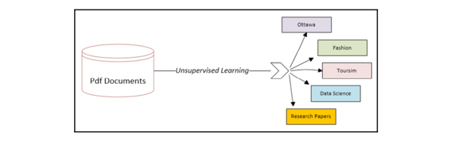

# Unsupervised Machine Learning Algorithms

## Introducing unsupervised learning

- The simplest definition of unsupervised learning is that it is the process of providing some sort of structure to
  unstructured data by discovering and utilizing the inherent patterns of the data.
- If data is not produced by some random process, it will have some patterns between its data elements in its
  multidimensional problem space.
- Unsupervised learning algorithms work by discovering these patterns and using them to provide some structure to the
  dataset
  

### Unsupervised learning in the data-mining lifecycle

- To understand the role of unsupervised learning, it is important to first look at the overall lifecycle of the
  data-mining process. There are different methodologies that divide the lifecycle of the data-mining into different
  independent stages, called **phases**.
- There are two popular ways to represent the data-mining lifecycle:
    - **CRISP-DM (Cross-Industry Standard Process for Data Mining)** lifecycle
    - **SEMMA (Sample, Explore, Modify, Model, Access)** data-mining process
- If we look at the CRISP-DM lifecycle, we can see that it consists of six distinct phases, which are shown in the
  following figure:
  
- Let's understand each phase one by one:
    - **Phase 1: Business Understanding**
        - This is about gathering the requirements and involves trying to fully understand the problem in depth from a
          business point of view.
        - Defining the scope of the problem and property rephrasing it accordingly to **machine learning (ML)** is an
          important part of this phase.
    - **Phase 2: Data Understanding**
        - This is about understanding the data that is available for data mining. In this phase, we will find out
          whether the right datasets are available for the problem we are trying to solve.
        - After identifying the datasets, we need to understand the quality of the data and its structure. We need to
          find out what patterns can be extracted out of the data that can potentially lead us toward important
          insights.
        - We will also try to find the right feature that can be used as the label according to the requirements
          gathered in Phase 1.
        - UL algorithms can play a powerful role in achieving the objectives of Phase 2.
        - It can be used for these purposes:
            - To discover patterns in the dataset
            - To understand the structure of the dataset by analyzing the discovered patterns
            - To identify or derive the target variable
    - **Phase 3: Data Preparation**
        - This is about preparing the data for the ML model that we will train in Phase 4. The available labeled data is
          divided into two unequal parts.
        - The larger portion is called the **training data** and is used for training the model downstream in Phase 4.
        - The smaller portion is called the **testing data** and is used in Phase 5 for model evaluation.
        - In this phase, the unsupervised machine learning algorithms can be used as a tool to prepare the data.
    - **Phase 4: Modeling**
        - This is the phase where we use supervised learning to formulate the patterns that we have discovered. We are
          expected to successfully prepare the data according to the requirements of our chosen supervised learning
          algorithm.
        - This is also the phase in which the particular feature that will be used as the label will be identified.
        - In Phase 3, we divided the data into testing and training sets. In this phase, we form mathematical
          formulations to represent the relationships in our patterns of interest. This is done by training the model
          using the training data that was created in Phase 3. As mentioned before, the resulting mathematical
          formulation will depend on our choice of algorithm.
    - **Phase 5: Evaluation**
        - This phase is about testing the newly trained model using the test data from Phase 3.
        - If the evaluation matches the expectations set in Phase 1, then we need iterate through all the preceding
          phases again, starting with Phase 1. This is illustrated in the preceding image.
    - **Phase 6: Deployment**
        - If the evaluation meets or exceeds the expectations described in Phase 5, then the trained model is deployed
          in production and starts generating a solution to the problem we defined in Phase 1.

### Practical examples

1. Voice categorization

- For example, let's assume that we have a recorded conversation of three people talking to each other for half an hour.
  Using unsupervised learning algorithms, we can identify the voices of distinct people in this dataset. Note that
  through unsupervised learning, we are adding structure to the given set of unstructured data. This structure gives us
  additional useful dimensions in our problem space that can be used to gain insights and to prepare data for our chosen
  machine learning algorithm. The following diagram shows how unsupervised learning is used for voice recognition:
  
  Note that, in this case, unsupervised learning suggests that we add a new feature with three distinct levels.

2. Document categorization

- Unsupervised machine learning algorithms can also be applied to a repository of unstructured textual data—for example,
  if we have a dataset of PDF documents, then unsupervised learning can be used to do the following:
    - Discover various topics in the dataset
    - Associate each PDF document to one of the discovered topics
      
      Note that, in this case, unsupervised learning suggests that we add a new feature with five distinct levels.

## Understanding cluster algorithms

- One of the simplest and most powerful techniques used in unsupervised learning is based on grouping similar patterns
  together through clustering algorithms. It is used to understand a particular aspect of the data that is related to
  the problem.
- Clustering algorithms look for natural grouping in data items. As the group is not based on any target or assumptions,
  it is classified as as an unsupervised learning technique.
- Grouping created by various clustering algorithms are based on _**finding the similarities**_ between various data
  points
  in the problem space. The best way to determine the similarity between data points will vary from problem and will
  depend on the nature of the problem we are dealing with.

### Quantifying similarities

- The reliability of the grouping created by clustering algorithms is based on the assumption that we can accurately
  quantify the similarities or closeness between various data points in the problem space.
- Three of the most popular methods that are used to quantify similarities:
    - Euclidean distance measure
    - Manhattan distance measure
    - Cosine distance measure

#### Euclidean distance measure

- The distance between different points can quantify the similarity between two data points and is extensively used in
  unsupervised machine learning techniques, such as clustering.
- Euclidean distance is the most common and simple distance measure used. It is calculated by measuring the shortest
  distance between two data points in multi-dimensional space.
- For `n`-dimensional problem space, we can calculate the distance between two points **A** and **B** as follows:
  

#### Manhattan distance

- In many situations, measuring the distance between two points using Euclidean distance measure will not truly
  represent the similarity or closeness between two points. For example, if two data points represent locations on a
  map, then the actual distance between them using ground transportation will be more than the distance calculated by
  the Euclidean distance.
- For situations such as these, we use Manhattan distance, which **marks the longest route** between two points and is a
  better reflection of the closeness of two points in the context of source and destination points that can be traveled
  to in a busy city.
- The Manhattan distance will always be equal or larger than the corresponding Euclidean distance calculated.

#### Cosine distance

- Euclidean and Manhattan distance measures do not perform well in high-dimensional space. In a high-dimensional problem
  space, cosine distance more accurately reflects the closeness between two data points in a multi-dimensional problem
  space.
- The cosine distance measure is calculated by measuring the cosine angle created by two points connected to a reference
  point.
- If the data points are close, then the angle will be narrow, on the other hand, if they are far away, then the angle
  will be larger.
- Textual data can almost be considered a highly dimensional space. As the cosine distance measure works very well with
  h-dimensional spaces, it is a good choice when dealing with textual data.
- Any point in the problem space can act as the reference data point, and it does not have to be the origin.

#### K-means clustering algorithm

- The name of the k-means clustering algorithm comes from the fact that it tries to create a number of clusters, `k`,
  calculating the means to find the closeness between the data points. It uses a relatively simple clustering approach,
  but it still popular because of its scalability and speed. Algorithmically, k-means clustering uses an iterative logic
  that moves the centers of the clusters until they reflect the most representative data point of the grouping they
  belong to.
- It is important to note that k-means algorithm lack one of the very basic functionalities needed for clustering.
    - That missing functionality is that for a given dataset, the k-means algorithm cannot determine the most
      appropriate number of clusters.
    - The most appropriate number of clusters, `k`, is dependent on the number of natural groupings in a particular
      dataset.
    - The philosophy behind here is to keep the algorithm as simple as possible, maximizing its performance.
    - The best way to determine `k` will depend on the problem we are trying to solve.

#### The logic of k-means clustering

##### Initialization

- In order to group them, the k-means algorithm uses a distance measure to find the similarity or closeness between data
  points. Before using the k-means algorithm, the most appropriate distance measure needs to be selected.
- By default, the Euclidean distance measure will be used. If the dataset has outliers, then a mechanism needs to be
  devised to determine the criteria that are to be identified and remove the outliers of the dataset.

##### The steps of the k-means algorithm

The steps involved in the k-means clustering algorithm are as follows:

| Steps  | Description                                                                                                                                                                                                                                                                                                                                                                                                                                                                |
|--------|----------------------------------------------------------------------------------------------------------------------------------------------------------------------------------------------------------------------------------------------------------------------------------------------------------------------------------------------------------------------------------------------------------------------------------------------------------------------------|
| Step 1 | We choose the number of clusters, `k`.                                                                                                                                                                                                                                                                                                                                                                                                                                     |
| Step 2 | Among the data points, we randomly choose `k` points as cluster centers.                                                                                                                                                                                                                                                                                                                                                                                                   |
| Step 3 | Based on the selected distance measure, we iteratively compute the distance from each point in the problem space to each of the `k` cluster center. Based on the size of the dataset, this may be a time-consuming step.                                                                                                                                                                                                                                                   |
| Step 4 | We assign each data point in the problem space to the nearst cluster center.                                                                                                                                                                                                                                                                                                                                                                                               |
| Step 5 | Each data point in our problem space has an assigned cluster center. Bet we are not done, as the selection of the initial cluster centers was based on random selection. We need to verify that the current randomly selected cluster centers are actually the center of gravity of each cluster. We recalculate the cluster centers by computing the mean of the constituent data point of each the `k` cluster. This step explains why this algorithm is called k-means. |
| Step 6 | If the cluster centers have shifted in step 5, this means that we need to recompute the cluster assignment for each data point. For this, we will go back to step 3 to repeat that compute intensive step. If the cluster centers have not shifted or if our predetermined stop condition has been satisfied, the we are done.                                                                                                                                             |

##### Stop condition

- For the k-means algorithm, the default stop condition is when there is no more shifting of cluster centers in step 5.
  But as with many other algorithms, k-means algorithms may take lot of time to converge, especially while processing
  large datasets in a high-dimensional problem space. Instead of waiting for the algorithm to converge, we can also
  explicitly define the stop condition as follows:
    - By specifying the maximum execution time:
        - **Stop condition**: `t > t_max` where `t` is the current execution time and `t_max` is the maximum execution
          time we have set for the algorithm.
    - By specifying the maximum iteration:
        - **Stop condition**: if `m > m_max` where `m` is the current iteration and `m_max` is the maximum number of
          iterations we have set for the algorithm.

#### Coding the k-means algorithm

- Implementation: [K means algorithm](k_means.py)

#### Limitation of k-means clustering

- The k-means algorith is designed to be a simple and fast algorithm, because of the intentional similarity in its
  design, it comes with the following limitations:
    - The biggest limitation of the k-means clustering is that that initial number of clusters has to be
      _predetermined_.
    - The initial assignment of cluster centers is _random_. This means that each time the algorithm is run, it may give
      slightly different clusters.
    - Each data point is assigned to only _one cluster_.
    - k-means clustering is _sensitive to outliers_.

### Hierarchical clustering

### Evaluating the clusters

### Application of clustering

## Dimensionality reduction

## Association rules mining

## Practical application - Clustering similar tweets together

## Anomaly - detection algorithms