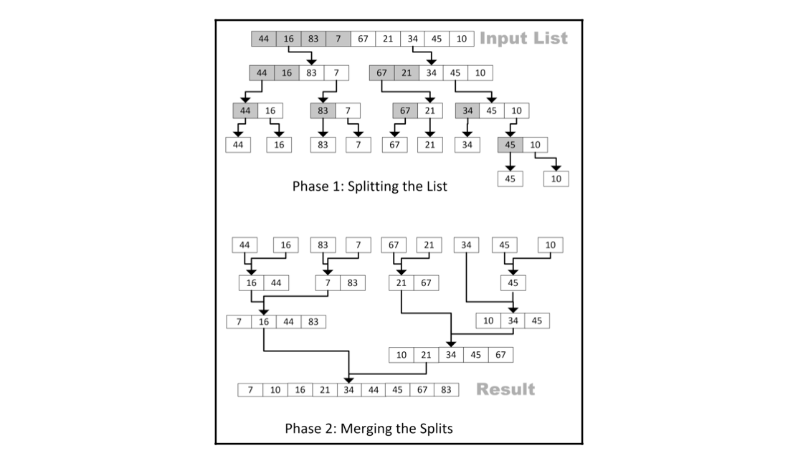
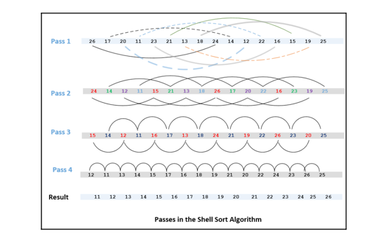
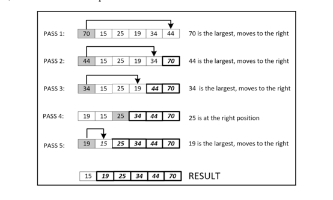

# Sorting algorithms
- In the era of big data, the ability to efficiently sort items in a complex data structure is quite important as it is needed by many modern algorithms.
- The right strategy to sort data will depend on the size and type of the data.

## Bubble Sort
- Bubble sort is the simplest and slowest algorithm used for sorting.
- It is designed in a way that the highest value in its list bubbles its way to the top as the algorithm loops through iterations.
- As its worst-case performance is `O(N2)`, it should be used for smaller datasets.

### The logic behind the scene
- Bubble sort is based on various iterations, called **passes**. For the list size `N`, bubble sort will have `N - 1` passes.
- Bubble sort compares adjacent neighbors values. If the value at a higher position is higher in value than the value at a lower position, we exchange the values. This iteration continues until we reach the end of the list.

- Implementation: [Bubble Sort](bubble.py)

### Performance Analysis
- It is easier to see that bubble sort involves two levels of loops:
  - **An outer loop**: This is also called **passes**.
  - **An inner loop**: This is when the remaining unsorted elements in the list are sorted, until the highest value is bubbled to the right. The first pass will have `N-1` comparisons, the second pass will have `N-2` comparisons, and each subsequent pass will reduce the number of comparisons by one.
- Due to two levels of looping, the worst-case runtime complexity would be `O(N2)`.

## Insertion Sort
- The basic idea of insertion sort is that in each iteration, we remove a data point from the data structure we have and then insert it into its right position. That is why we call this **the insertion sort algorithm**.
- In the first iteration, we select the two data points and sort them. Then, we expand our selection and select the third data point and find its correct position, based on its value. The algorithm progresses until all the data points are moved to their correct positions.

- Implementation: [Insertion Sort](insertion.py)

### Performance Analysis
- If the data structure is sorted, then the insertion sort will have a linear running time `O(n)`.
- The worst case is when each of the inner loops has to move all the elements in the list `O(n2)`.
- Insertion can be used on small data structures. For larger data structures, insertion sort is not recommended due to quadratic average performance.

## Merge Sort
- Merge sort algorithm was developed in 1940 by _John von Neumann_.
- The defining feature of this algorithm is that its performance is not dependent on whether the input data is sorted.
- Two phases:
  - _First phase (splitting)_: the algorithm keeps on dividing the data into two parts recursively, until the size of the data is less than the defined threshold.
  - _Second phase (merging)_: the algorithm keeps on merging and processing until we get the final result.

- Implementation steps:
  1. It divides the input list into two equal parts.
  2. It uses recursion to split until the length of each list is 1.
  3. It merges the sorted parts into a sorted list and returns it.

- Implementation: [Merge Sort](merge.py)

## Shell Sort
- The bubble sort algorithm compares immediate neighbors and exchanges them if they are out of order. If we have a partially sorted list, bubble sort should give reasonable performance as it will exit as soon as no more swapping of elements occurs in a loop.
- But for a totally unsorted list, sized _`N`_, you can argue that bubble sort will have to fully iterate through _`N-1`_ passes in order to get it fully sorted.
### The logic behind the scene
- In pass one, instead of selecting immediate neighbors, we use elements that are at a fixed gap, eventually sorting a sublist consisting of a pair of data points.
- In pass two, it sorts sublists containing four data points.
- In subsequent passes, the number of data points per sublist keeps on increasing and the number of sublists keeps on decreasing until we reach a situation where there is just one sublist that consists of all the data points.
- We got a sorted list.

- Implementation: [Shell Sort](shell.py)

### Performance Analysis
- Shell sort is not for big data. It is used for medium-sized datasets.
- If the data is partially in the correct order, the performance will be better.
- In the best-case scenario, if a list is already sorted, it will only need one pass through _N_ elements to validate the order, producing a best-case performance of _`O(N)`_

## Selection Sort
- Selection sort is an improvement on bubble sort, where we try to minimize the total number of swaps required.
- It is designed to make one swap for each pass (compared to `N - 1` passes of bubble sort`).
- Instead of bubbling the largest value toward the top, we look for the largest value in each pass and move it toward the top.
- Then after the first pass, the largest value will be at the top.
- After the second pass, the second-largest value will be next to the top value.
- As the algorithm progresses, the subsequent values will move to their correct place based on their values.
- The last value will be moved after the _(N-1)th_ pass. So, selection sort takes _N-1_ passes to sort N items.

- Implementation: [Selection Sort](selection.py)

### Performance Analysis
- Selection sort's worst-case performance is `O(N2)`.
- It should not be used for sorting larger datasets.
- Selection sort is better designed algorithm than bubble sort and its average performance is better than bubble sort due to the reduction in the number of exchanges.

## Choosing a sorting algorithm
- The choice of the right sort algorithm depends both on the _size_ and the _state_ of the current input data.
- For small input lists that are sorted, using an advanced algorithm will introduce unnecessary complexities to the code, with a negligible improvement in performance.
- If the data is partially sorted, we can take advantage of that by using insertion sort.
- For larger datasets, the merge sort algorithm is the best one to use.