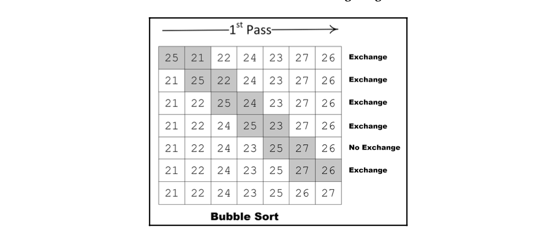
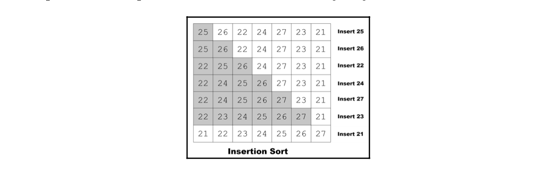

# Sorting algorithms
- In the era of big data, the ability to efficiently sort items in a complex data structure is quite important as it is needed by many modern algorithms.
- The right strategy to sort data will depend on the size and type of the data.

## Bubble Sort
- Bubble sort is the simplest and slowest algorithm used for sorting.
- It is designed in a way that the highest value in its list bubbles its way to the top as the algorithm loops through iterations.
- As its worst-case performance is `O(N2)`, it should be used for smaller datasets.

### The logic behind the scene
- Bubble sort is based on various iterations, called **passes**. For the list size `N`, bubble sort will have `N - 1` passes.
- Bubble sort compares adjacent neighbors values. If the value at a higher position is higher in value than the value at a lower position, we exchange the values. This iteration continues until we reach the end of the list.

- Implementation: [Bubble Sort](bubble.py)

### Performance Analysis
- It is easier to see that bubble sort involves two levels of loops:
  - **An outer loop**: This is also called **passes**.
  - **An inner loop**: This is when the remaining unsorted elements in the list are sorted, until the highest value is bubbled to the right. The first pass will have `N-1` comparisons, the second pass will have `N-2` comparisons, and each subsequent pass will reduce the number of comparisons by one.
- Due to two levels of looping, the worst-case runtime complexity would be `O(N2)`.

## Insertion Sort
- The basic idea of insertion sort is that in each iteration, we remove a data point from the data structure we have and then insert it into its right position. That is why we call this **the insertion sort algorithm**.
- In the first iteration, we select the two data points and sort them. Then, we expand our selection and select the third data point and find its correct position, based on its value. The algorithm progresses until all the data points are moved to their correct positions.

- Implementation: [Insertion Sort](insertion.py)

### Performance Analysis
- If the data structure is sorted, then the insertion sort will have a linear running time `O(n)`.
- The worst case is when each of the inner loops has to move all the elements in the list `O(n2)`.
- Insertion can be used on small data structures. For larger data structures, insertion sort is not recommended due to quadratic average performance.
