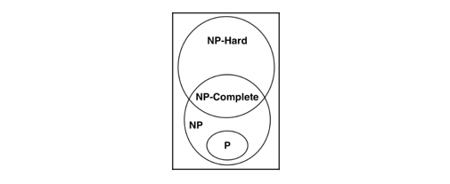

# Designing Algorithms
> Discuss the strengths and weaknesses of various techniques for designing algorithms.
## Introduction the basic concepts of design an algorithm
> "A finite set of unambiguous instructions that given some set of initial conditions can be performed in a prescribed sequence to achieve a certain goal and that has a recognized set of end conditions."
### Concern 1 - Will the designed algorithm produce the result we expect?
To verify an algorithm, we need to think about the following two aspects:
1. **_Defining the truth_**
   - To verify the algorithm, we need some known correct results for a given set of inputs. These known correct results are called the **truths**, in the context of the problem we are trying to solve.
   - The **truth** is important as it is used as a reference when we iteratively work on evolving our algorithm toward a better solution.
2. **_Choosing metrics_**
   - We also need to think about how are we going to quantify the deviation from the defined truth.
   - Choosing the correct metrics will help us to accurately quantify the quality of our algorithm.

### Concern 2 - Is this the optimal way to get these results?
This is about finding the answer to the following question:
 
_Is this the optimal solution and can we verify that no other solution exists for this problem that is better than our solution?_
 
But we need to consider this question as well:
 
_Should we aim to find the optimal solution for this problem? Finding and verifying the optimal
solution is so time-consuming and complex that a workable solution based on heuristics is our best
bet._
 
So understanding the problem and its complexities is important and helps us estimate the resource requirements.
 
A couple terms we need to know:
- **Polynomial algorithm**: If an algorithm has a time complexity of `O(N^k)`, we call it a polynomial algorithm, where `k` is a constant.
- **Certificate**: A proposed candidate solution produced at the end of an iteration is called a **certificate**. As we process iteratively in solving a problem, we typically generate a series of certificates. If the solution is moving toward convergence, each generated certificate will be better than the previous one. At some point, when our certificate meets the requirements, we will choose it as the final solution.

#### Characterizing the complexity of the problem
Before we attempt to design a solution to a problem, it makes sense to first try to characterize it. Generally, there are three types of problems:
- **Type 1**: Problems for which we can guarantee that a polynomial algorithm exists that can be used to solve them.
- **Type 2**: Problems for which we can prove that they cannot be solved by a polynomial algorithm.
- **Type 3**: Problems for which we are unable to find a polynomial algorithm to solve them, but we are also unable to prove that a polynomial solution for those problems is impossible to find.
Various classes of problems:
- **Non-Deterministic Polynomial (NP)**: For a problem to be an NP problem, it has to meet this condition
  - It is guaranteed that there is a polynomial algorithm that can be used to verify that the candidate solution (certificate) is optimal.
- **Polynomial (P)**: There are types of problems that can be thought of as a subset of NP. P problems need to meet this condition
  - It is guaranteed that there is at least one polynomial algorithm that can be used to solve them.
- **NP-complete**
- **NP-hard**

### Concern 3 - How is the algorithm going to perform on larger datasets?
- An algorithm processes data in a defined way to produce a result. As the size of the data increases, it takes more and more time to process the data and calculate the required result.
- The term _big data_ is used to identify datasets that are expected to be challenging for the infrastructure and algorithms to work with.
- To quantify the scalability of an algorithm, we need to keep the following two aspects in mind:
  - **The increase in resource requirements as the input data is increased**: Estimating a requirement such as this is called space complexity analysis.
  - **The increase in the time taken to run as the input data is increased**: Estimating this is called time complexity analysis.
- While in the development-and-testing phase, many algorithms use only a small sample of data. When designing an algorithm, it is important to look into the scalability aspect of the algorithms.

## Understand algorithm strategies
### Understanding the divide-and-conquer strategy
### Understanding the dynamic programming strategy
### Understanding greedy algorithms

## Practical application - Solving the TSP
### Using a brute-force strategy
### Using a greedy algorithm

## Presenting the PageRank algorithm
### Problem definition
### Implement the PageRank algorithm

## Understanding linear programming
### Formulating a linear programming problem
